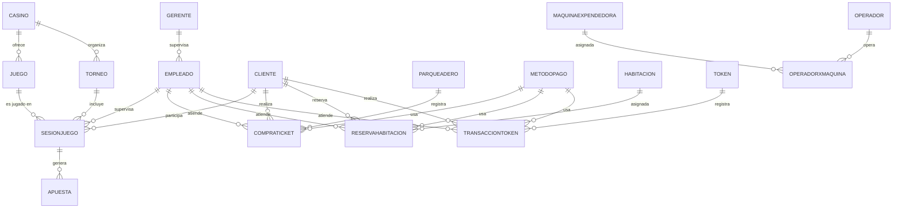

Este proyecto de referencia presenta el diseño e implementación de una base de datos relacional completa para un **casino hotelero**. El esquema cubre la gestión de juegos, sesiones de clientes, registro de apuestas, torneos, administración de empleados, reservas de habitaciones, parqueadero y transacciones con tokens. Fue desarrollado como ejemplo guía dentro del curso **Bases de Datos Relacionales 2026-I** y puede servir como punto de partida o plantilla de comparación para los proyectos propios de los estudiantes.

<Note>
  Este proyecto fue diseñado originalmente para **MySQL 8**. Los tipos de dato `AUTO_INCREMENT`, la sintaxis de llave foránea y algunas funciones de fecha difieren en PostgreSQL. Para migrar el esquema, reemplaza `AUTO_INCREMENT` por `SERIAL` (o `GENERATED ALWAYS AS IDENTITY`) y ajusta los tipos `DATETIME` a `TIMESTAMP`.
</Note>

## Universo de Discurso

El casino hotelero se identifica con un NIT único (`nitCasino`) y registra su ubicación y capacidad máxima de clientes. Ofrece un catálogo de **juegos** (póker, ruleta, blackjack, etc.) cada uno con su tipo, nombre y descripción, todos vinculados al casino. Los **clientes** registrados participan en **sesiones de juego** (`sesionjuego`) que pueden asociarse a un empleado supervisor y a un torneo activo. Dentro de cada sesión el cliente genera una o varias **apuestas** de las que se registra el monto, la fecha/hora, el resultado y la ganancia.

El establecimiento también gestiona **gerentes** que supervisan al personal, **empleados** referenciados a su gerente, y servicios adicionales como el **parqueadero** (con control de placa, tipo de vehículo y tarifa por hora) registrado en `compraticket`, la reserva de **habitaciones** con desglose de tarifas, y un sistema de **tokens** cuyas transacciones de compra/canje se almacenan en `transacciontoken`. Las **máquinas expendedoras** son operadas por **operadores** externos registrados en `operadorxmaquina`. Los **torneos** tienen premio, capacidad, fechas y estado, y están vinculados al casino.

## Esquema Relacional

```sql
-- ──────────────────────────────────────────────
-- Tablas maestras independientes
-- ──────────────────────────────────────────────

CREATE TABLE casino (
  nitCasino         INT          NOT NULL,
  ubicacion         VARCHAR(255) DEFAULT NULL,
  capacidadClientes INT          DEFAULT NULL,
  PRIMARY KEY (nitCasino)
);

CREATE TABLE gerente (
  idGerente   INT          NOT NULL AUTO_INCREMENT,
  nombre      VARCHAR(100) NOT NULL,
  apellido    VARCHAR(100) NOT NULL,
  cedGerente  VARCHAR(20)  NOT NULL,
  estado      VARCHAR(50)  DEFAULT NULL,
  PRIMARY KEY (idGerente)
);

CREATE TABLE habitacion (
  idHabitacion INT         NOT NULL AUTO_INCREMENT,
  capacidad    INT         NOT NULL,
  tipo         VARCHAR(50) NOT NULL,
  estado       VARCHAR(50) NOT NULL,
  PRIMARY KEY (idHabitacion)
);

CREATE TABLE maquinaexpendedora (
  numSerie         INT            NOT NULL,
  capacidad        INT            DEFAULT NULL,
  montoDisponible  DECIMAL(10,2)  DEFAULT NULL,
  tipo             VARCHAR(50)    DEFAULT NULL,
  PRIMARY KEY (numSerie)
);

CREATE TABLE metodopago (
  idPago     INT  NOT NULL AUTO_INCREMENT,
  tipoPago   VARCHAR(50) DEFAULT NULL,
  datosPago  TEXT,
  PRIMARY KEY (idPago)
);

CREATE TABLE operador (
  idOperador   INT          NOT NULL AUTO_INCREMENT,
  cedOperador  VARCHAR(20)  DEFAULT NULL,
  nombre       VARCHAR(100) DEFAULT NULL,
  nomEmpresa   VARCHAR(100) DEFAULT NULL,
  PRIMARY KEY (idOperador)
);

CREATE TABLE parqueadero (
  idParqueadero INT NOT NULL AUTO_INCREMENT,
  motosLibre    INT DEFAULT NULL,
  carrosLibre   INT DEFAULT NULL,
  capacidad     INT DEFAULT NULL,
  PRIMARY KEY (idParqueadero)
);

CREATE TABLE token (
  idToken    INT           NOT NULL AUTO_INCREMENT,
  valor      DECIMAL(10,2) DEFAULT NULL,
  tipoToken  VARCHAR(50)   DEFAULT NULL,
  PRIMARY KEY (idToken)
);

-- ──────────────────────────────────────────────
-- Entidades que dependen de casino / gerente
-- ──────────────────────────────────────────────

CREATE TABLE juego (
  idJuego     INT          NOT NULL AUTO_INCREMENT,
  tipoJuego   VARCHAR(50)  DEFAULT NULL,
  nombre      VARCHAR(100) DEFAULT NULL,
  descripcion TEXT,
  idCasino    INT          DEFAULT NULL,
  PRIMARY KEY (idJuego),
  FOREIGN KEY (idCasino) REFERENCES casino(nitCasino) ON UPDATE CASCADE
);

CREATE TABLE torneo (
  idTorneo         INT           NOT NULL AUTO_INCREMENT,
  premio           DECIMAL(10,2) DEFAULT NULL,
  fechaHoraInicio  DATETIME      DEFAULT NULL,
  fechaHoraFinal   DATETIME      DEFAULT NULL,
  estado           VARCHAR(50)   DEFAULT NULL,
  capacidad        INT           DEFAULT NULL,
  numParticipantes INT           DEFAULT NULL,
  idCasino         INT           DEFAULT NULL,
  PRIMARY KEY (idTorneo),
  FOREIGN KEY (idCasino) REFERENCES casino(nitCasino) ON UPDATE CASCADE
);

CREATE TABLE empleado (
  idEmpleado  INT           NOT NULL AUTO_INCREMENT,
  cedEmpleado VARCHAR(20)   NOT NULL,
  nombre      VARCHAR(100)  NOT NULL,
  apellido    VARCHAR(100)  NOT NULL,
  teléfono    VARCHAR(20)   DEFAULT NULL,
  correo      VARCHAR(100)  DEFAULT NULL,
  salario     DECIMAL(10,2) DEFAULT NULL,
  idGerente   INT           DEFAULT NULL,
  PRIMARY KEY (idEmpleado),
  FOREIGN KEY (idGerente) REFERENCES gerente(idGerente) ON UPDATE CASCADE
);

CREATE TABLE cliente (
  idCliente   INT          NOT NULL AUTO_INCREMENT,
  cedCliente  VARCHAR(20)  NOT NULL,
  nombre      VARCHAR(100) NOT NULL,
  apellido    VARCHAR(100) NOT NULL,
  teléfono    VARCHAR(20)  DEFAULT NULL,
  correo      VARCHAR(100) DEFAULT NULL,
  edad        INT          DEFAULT NULL,
  PRIMARY KEY (idCliente)
);

-- ──────────────────────────────────────────────
-- Sesiones, apuestas y operaciones
-- ──────────────────────────────────────────────

CREATE TABLE sesionjuego (
  idSesion        INT      NOT NULL AUTO_INCREMENT,
  idJuego         INT      DEFAULT NULL,
  idCliente       INT      DEFAULT NULL,
  fechaHoraInicio DATETIME DEFAULT NULL,
  fechaHoraFinal  DATETIME DEFAULT NULL,
  idEmpleado      INT      DEFAULT NULL,
  idTorneo        INT      DEFAULT NULL,
  PRIMARY KEY (idSesion),
  FOREIGN KEY (idJuego)    REFERENCES juego(idJuego)       ON UPDATE CASCADE,
  FOREIGN KEY (idCliente)  REFERENCES cliente(idCliente)   ON UPDATE CASCADE,
  FOREIGN KEY (idEmpleado) REFERENCES empleado(idEmpleado) ON UPDATE CASCADE,
  FOREIGN KEY (idTorneo)   REFERENCES torneo(idTorneo)     ON UPDATE CASCADE
);

CREATE TABLE apuesta (
  idApuesta      INT           NOT NULL AUTO_INCREMENT,
  idSesionJuego  INT           DEFAULT NULL,
  montoApuesta   DECIMAL(10,2) DEFAULT NULL,
  fechaHora      DATETIME      DEFAULT NULL,
  resultado      VARCHAR(50)   DEFAULT NULL,
  montoGanancia  DECIMAL(10,2) DEFAULT NULL,
  PRIMARY KEY (idApuesta),
  FOREIGN KEY (idSesionJuego) REFERENCES sesionjuego(idSesion) ON UPDATE CASCADE
);

CREATE TABLE compraticket (
  idCompra        INT           NOT NULL AUTO_INCREMENT,
  idCliente       INT           DEFAULT NULL,
  idParqueadero   INT           DEFAULT NULL,
  placa           VARCHAR(20)   DEFAULT NULL,
  tipoVehiculo    VARCHAR(50)   DEFAULT NULL,
  tarifaxhora     DECIMAL(10,2) DEFAULT NULL,
  fechaHoraInicio DATETIME      DEFAULT NULL,
  fechaHoraFinal  DATETIME      DEFAULT NULL,
  total           DECIMAL(10,2) DEFAULT NULL,
  estado          VARCHAR(50)   DEFAULT NULL,
  idMetodoPago    INT           DEFAULT NULL,
  idEmpleado      INT           DEFAULT NULL,
  PRIMARY KEY (idCompra),
  FOREIGN KEY (idCliente)     REFERENCES cliente(idCliente)         ON UPDATE CASCADE,
  FOREIGN KEY (idMetodoPago)  REFERENCES metodopago(idPago)         ON UPDATE CASCADE,
  FOREIGN KEY (idParqueadero) REFERENCES parqueadero(idParqueadero) ON UPDATE CASCADE,
  FOREIGN KEY (idEmpleado)    REFERENCES empleado(idEmpleado)       ON UPDATE CASCADE
);

CREATE TABLE reservahabitacion (
  idReserva              INT           NOT NULL AUTO_INCREMENT,
  idHabitacion           INT           DEFAULT NULL,
  idCliente              INT           DEFAULT NULL,
  idMetodoPago           INT           DEFAULT NULL,
  fechaHoraInicio        DATETIME      DEFAULT NULL,
  fechaHoraFinal         DATETIME      DEFAULT NULL,
  descripción            TEXT,
  tarifaxproductoBarato  DECIMAL(10,2) DEFAULT NULL,
  tarifaxproductoMedio   DECIMAL(10,2) DEFAULT NULL,
  tarifaxproductoCaro    DECIMAL(10,2) DEFAULT NULL,
  tarifaXdia             DECIMAL(10,2) DEFAULT NULL,
  total                  DECIMAL(10,2) DEFAULT NULL,
  idEmpleado             INT           DEFAULT NULL,
  nProdBarato            INT           DEFAULT NULL,
  nProdMedio             INT           DEFAULT NULL,
  nProdCaro              INT           DEFAULT NULL,
  PRIMARY KEY (idReserva),
  FOREIGN KEY (idHabitacion) REFERENCES habitacion(idHabitacion) ON UPDATE CASCADE,
  FOREIGN KEY (idCliente)    REFERENCES cliente(idCliente)       ON UPDATE CASCADE,
  FOREIGN KEY (idEmpleado)   REFERENCES empleado(idEmpleado)     ON UPDATE CASCADE,
  FOREIGN KEY (idMetodoPago) REFERENCES metodopago(idPago)       ON UPDATE CASCADE
);

CREATE TABLE transacciontoken (
  idTransaccion    INT           NOT NULL AUTO_INCREMENT,
  idToken          INT           DEFAULT NULL,
  idCliente        INT           DEFAULT NULL,
  tipoTransaccion  VARCHAR(50)   DEFAULT NULL,
  cobro            DECIMAL(10,2) DEFAULT NULL,
  cantidad         INT           DEFAULT NULL,
  fechaHora        DATETIME      DEFAULT NULL,
  idMetodoPago     INT           DEFAULT NULL,
  idEmpleado       INT           DEFAULT NULL,
  PRIMARY KEY (idTransaccion),
  FOREIGN KEY (idToken)       REFERENCES token(idToken)           ON UPDATE CASCADE,
  FOREIGN KEY (idCliente)     REFERENCES cliente(idCliente)       ON UPDATE CASCADE,
  FOREIGN KEY (idMetodoPago)  REFERENCES metodopago(idPago)       ON UPDATE CASCADE,
  FOREIGN KEY (idEmpleado)    REFERENCES empleado(idEmpleado)     ON UPDATE CASCADE
);

CREATE TABLE operadorxmaquina (
  idOperadorMaquina INT           NOT NULL AUTO_INCREMENT,
  fecha             DATE          DEFAULT NULL,
  costo             DECIMAL(10,2) DEFAULT NULL,
  descripcion       TEXT,
  maquinaExp        INT           DEFAULT NULL,
  idOperador        INT           DEFAULT NULL,
  PRIMARY KEY (idOperadorMaquina),
  FOREIGN KEY (maquinaExp) REFERENCES maquinaexpendedora(numSerie) ON UPDATE CASCADE,
  FOREIGN KEY (idOperador) REFERENCES operador(idOperador)         ON UPDATE CASCADE
);
```

## Diagrama Entidad-Relación



## Consultas SQL de Referencia

Las siguientes consultas ilustran los patrones más comunes que deben cubrirse en el proyecto.

<Tabs>
  <Tab title="Agregación y ranking">
```sql
-- Clientes con más apuestas: ranking de actividad
SELECT
  c.nombre,
  c.apellido,
  COUNT(a.idApuesta)      AS total_apuestas,
  SUM(a.montoApuesta)     AS total_apostado,
  SUM(a.montoGanancia)    AS total_ganado,
  SUM(a.montoGanancia)
    - SUM(a.montoApuesta) AS ganancia_neta
FROM cliente c
JOIN sesionjuego s ON c.idCliente    = s.idCliente
JOIN apuesta     a ON s.idSesion     = a.idSesionJuego
GROUP BY c.idCliente, c.nombre, c.apellido
ORDER BY total_apuestas DESC;
```
  </Tab>
  <Tab title="JOINs múltiples">
```sql
-- Juego más popular medido por número de sesiones
SELECT
  j.nombre          AS nombreJuego,
  j.tipoJuego,
  COUNT(s.idSesion) AS total_sesiones
FROM juego j
JOIN sesionjuego s ON j.idJuego = s.idJuego
GROUP BY j.idJuego, j.nombre, j.tipoJuego
ORDER BY total_sesiones DESC;

-- Torneos activos con número de sesiones registradas
SELECT
  t.idTorneo,
  t.premio,
  t.estado,
  COUNT(s.idSesion) AS sesiones_registradas
FROM torneo t
LEFT JOIN sesionjuego s ON t.idTorneo = s.idTorneo
WHERE t.estado = 'activo'
GROUP BY t.idTorneo, t.premio, t.estado;
```
  </Tab>
  <Tab title="Subconsultas">
```sql
-- Clientes cuyo total apostado supera el promedio general
SELECT c.nombre, c.apellido, resumen.total_apostado
FROM cliente c
JOIN (
  SELECT s.idCliente,
         SUM(a.montoApuesta) AS total_apostado
  FROM sesionjuego s
  JOIN apuesta a ON s.idSesion = a.idSesionJuego
  GROUP BY s.idCliente
) AS resumen ON c.idCliente = resumen.idCliente
WHERE resumen.total_apostado > (
  SELECT AVG(sub.total_apostado)
  FROM (
    SELECT SUM(a2.montoApuesta) AS total_apostado
    FROM sesionjuego s2
    JOIN apuesta a2 ON s2.idSesion = a2.idSesionJuego
    GROUP BY s2.idCliente
  ) AS sub
)
ORDER BY resumen.total_apostado DESC;
```
  </Tab>
  <Tab title="Parqueadero">
```sql
-- Ingresos por parqueadero en el último mes
SELECT
  p.idParqueadero,
  p.capacidad,
  COUNT(ct.idCompra) AS tickets_emitidos,
  SUM(ct.total)      AS ingresos_totales
FROM parqueadero p
LEFT JOIN compraticket ct
  ON p.idParqueadero = ct.idParqueadero
  AND ct.fechaHoraInicio >= DATE_SUB(NOW(), INTERVAL 1 MONTH)
GROUP BY p.idParqueadero, p.capacidad
ORDER BY ingresos_totales DESC;
```
  </Tab>
</Tabs>

## Diccionario de Datos

<AccordionGroup>
  <Accordion title="casino">
    | Columna | Tipo | Restricciones | Descripción |
    |---|---|---|---|
    | `nitCasino` | INT | PK, NOT NULL | Número de identificación tributaria del casino. Clave natural del negocio. |
    | `ubicacion` | VARCHAR(255) | — | Dirección física o descripción de la ubicación del establecimiento. |
    | `capacidadClientes` | INT | — | Número máximo de clientes que pueden estar simultáneamente en el casino. |
  </Accordion>

  <Accordion title="gerente">
    | Columna | Tipo | Restricciones | Descripción |
    |---|---|---|---|
    | `idGerente` | INT | PK, AUTO_INCREMENT | Identificador del gerente. |
    | `nombre` | VARCHAR(100) | NOT NULL | Nombre del gerente. |
    | `apellido` | VARCHAR(100) | NOT NULL | Apellido del gerente. |
    | `cedGerente` | VARCHAR(20) | NOT NULL | Cédula del gerente. |
    | `estado` | VARCHAR(50) | — | Estado laboral (activo, retirado, etc.). |
  </Accordion>

  <Accordion title="empleado">
    | Columna | Tipo | Restricciones | Descripción |
    |---|---|---|---|
    | `idEmpleado` | INT | PK, AUTO_INCREMENT | Identificador interno del empleado. |
    | `cedEmpleado` | VARCHAR(20) | NOT NULL | Cédula o documento de identidad del empleado. |
    | `nombre` | VARCHAR(100) | NOT NULL | Nombre del empleado. |
    | `apellido` | VARCHAR(100) | NOT NULL | Apellido del empleado. |
    | `teléfono` | VARCHAR(20) | — | Número de contacto del empleado. |
    | `correo` | VARCHAR(100) | — | Correo electrónico del empleado. |
    | `salario` | DECIMAL(10,2) | — | Salario mensual del empleado. |
    | `idGerente` | INT | FK → gerente | Gerente al que reporta el empleado. |
  </Accordion>

  <Accordion title="cliente">
    | Columna | Tipo | Restricciones | Descripción |
    |---|---|---|---|
    | `idCliente` | INT | PK, AUTO_INCREMENT | Identificador interno del cliente. |
    | `cedCliente` | VARCHAR(20) | NOT NULL | Número de cédula o documento de identidad del cliente. |
    | `nombre` | VARCHAR(100) | NOT NULL | Primer nombre del cliente. |
    | `apellido` | VARCHAR(100) | NOT NULL | Apellido del cliente. |
    | `teléfono` | VARCHAR(20) | — | Número de contacto telefónico. |
    | `correo` | VARCHAR(100) | — | Correo electrónico del cliente. |
    | `edad` | INT | — | Edad del cliente en años. Se recomienda agregar `CHECK (edad >= 18)` para cumplir la regulación. |
  </Accordion>

  <Accordion title="juego">
    | Columna | Tipo | Restricciones | Descripción |
    |---|---|---|---|
    | `idJuego` | INT | PK, AUTO_INCREMENT | Identificador del tipo de juego. |
    | `tipoJuego` | VARCHAR(50) | — | Categoría del juego (ej. `mesa`, `maquina`, `electronico`). |
    | `nombre` | VARCHAR(100) | — | Nombre comercial del juego (ej. Blackjack, Ruleta, Póker). |
    | `descripcion` | TEXT | — | Descripción general del juego. |
    | `idCasino` | INT | FK → casino | Casino al que pertenece el juego. |
  </Accordion>

  <Accordion title="torneo">
    | Columna | Tipo | Restricciones | Descripción |
    |---|---|---|---|
    | `idTorneo` | INT | PK, AUTO_INCREMENT | Identificador del torneo. |
    | `premio` | DECIMAL(10,2) | — | Valor monetario del premio del torneo. |
    | `fechaHoraInicio` | DATETIME | — | Fecha y hora de inicio del torneo. |
    | `fechaHoraFinal` | DATETIME | — | Fecha y hora de cierre del torneo. |
    | `estado` | VARCHAR(50) | — | Estado del torneo: `activo`, `finalizado`, `cancelado`. |
    | `capacidad` | INT | — | Máximo de participantes admitidos. |
    | `numParticipantes` | INT | — | Cantidad actual de participantes inscritos. |
    | `idCasino` | INT | FK → casino | Casino que organiza el torneo. |
  </Accordion>

  <Accordion title="sesionjuego">
    | Columna | Tipo | Restricciones | Descripción |
    |---|---|---|---|
    | `idSesion` | INT | PK, AUTO_INCREMENT | Identificador de la sesión de juego. |
    | `idJuego` | INT | FK → juego | Juego que se disputa en la sesión. |
    | `idCliente` | INT | FK → cliente | Cliente que participa en la sesión. |
    | `fechaHoraInicio` | DATETIME | — | Marca de tiempo de inicio de la sesión. |
    | `fechaHoraFinal` | DATETIME | — | Marca de tiempo de fin; `NULL` si la sesión está activa. |
    | `idEmpleado` | INT | FK → empleado | Empleado (crupier/supervisor) que atiende la sesión. |
    | `idTorneo` | INT | FK → torneo | Torneo al que pertenece la sesión, si aplica. |
  </Accordion>

  <Accordion title="apuesta">
    | Columna | Tipo | Restricciones | Descripción |
    |---|---|---|---|
    | `idApuesta` | INT | PK, AUTO_INCREMENT | Identificador de la apuesta. |
    | `idSesionJuego` | INT | FK → sesionjuego (ON UPDATE CASCADE) | Sesión en la que se realizó la apuesta. |
    | `montoApuesta` | DECIMAL(10,2) | — | Valor monetario apostado. |
    | `fechaHora` | DATETIME | — | Fecha y hora exacta de la apuesta. |
    | `resultado` | VARCHAR(50) | — | Resultado de la apuesta: `ganada`, `perdida`, `empate`. |
    | `montoGanancia` | DECIMAL(10,2) | — | Monto recibido por el cliente si ganó; `0` o `NULL` si perdió. |
  </Accordion>

  <Accordion title="habitacion">
    | Columna | Tipo | Restricciones | Descripción |
    |---|---|---|---|
    | `idHabitacion` | INT | PK, AUTO_INCREMENT | Identificador de la habitación. |
    | `capacidad` | INT | NOT NULL | Número de personas que admite la habitación. |
    | `tipo` | VARCHAR(50) | NOT NULL | Tipo de habitación (sencilla, doble, suite, etc.). |
    | `estado` | VARCHAR(50) | NOT NULL | Estado operacional: `disponible`, `ocupada`, `en mantenimiento`. |
  </Accordion>

  <Accordion title="reservahabitacion">
    | Columna | Tipo | Restricciones | Descripción |
    |---|---|---|---|
    | `idReserva` | INT | PK, AUTO_INCREMENT | Identificador de la reserva. |
    | `idHabitacion` | INT | FK → habitacion | Habitación reservada. |
    | `idCliente` | INT | FK → cliente | Cliente que realiza la reserva. |
    | `idMetodoPago` | INT | FK → metodopago | Método de pago utilizado. |
    | `fechaHoraInicio` | DATETIME | — | Inicio de la estadía. |
    | `fechaHoraFinal` | DATETIME | — | Fin de la estadía. |
    | `descripción` | TEXT | — | Observaciones o notas de la reserva. |
    | `tarifaxproductoBarato` | DECIMAL(10,2) | — | Tarifa unitaria de productos de categoría baja. |
    | `tarifaxproductoMedio` | DECIMAL(10,2) | — | Tarifa unitaria de productos de categoría media. |
    | `tarifaxproductoCaro` | DECIMAL(10,2) | — | Tarifa unitaria de productos de categoría alta. |
    | `tarifaXdia` | DECIMAL(10,2) | — | Tarifa diaria de la habitación. |
    | `total` | DECIMAL(10,2) | — | Valor total cobrado por la reserva. |
    | `idEmpleado` | INT | FK → empleado | Empleado que gestionó el check-in. |
    | `nProdBarato` | INT | — | Cantidad de productos baratos consumidos. |
    | `nProdMedio` | INT | — | Cantidad de productos medios consumidos. |
    | `nProdCaro` | INT | — | Cantidad de productos caros consumidos. |
  </Accordion>

  <Accordion title="parqueadero">
    | Columna | Tipo | Restricciones | Descripción |
    |---|---|---|---|
    | `idParqueadero` | INT | PK, AUTO_INCREMENT | Identificador del parqueadero. |
    | `motosLibre` | INT | — | Espacios disponibles para motos. |
    | `carrosLibre` | INT | — | Espacios disponibles para carros. |
    | `capacidad` | INT | — | Capacidad total del parqueadero. |
  </Accordion>

  <Accordion title="compraticket">
    | Columna | Tipo | Restricciones | Descripción |
    |---|---|---|---|
    | `idCompra` | INT | PK, AUTO_INCREMENT | Identificador del ticket de parqueadero. |
    | `idCliente` | INT | FK → cliente (ON UPDATE CASCADE) | Cliente al que se le emite el ticket. |
    | `idParqueadero` | INT | FK → parqueadero (ON UPDATE CASCADE) | Parqueadero donde se registra el vehículo. |
    | `placa` | VARCHAR(20) | — | Placa del vehículo. |
    | `tipoVehiculo` | VARCHAR(50) | — | Tipo de vehículo: `carro`, `moto`, `bicicleta`. |
    | `tarifaxhora` | DECIMAL(10,2) | — | Tarifa aplicada por hora de permanencia. |
    | `fechaHoraInicio` | DATETIME | — | Hora de ingreso del vehículo. |
    | `fechaHoraFinal` | DATETIME | — | Hora de salida del vehículo. |
    | `total` | DECIMAL(10,2) | — | Valor total cobrado por el servicio de parqueo. |
    | `estado` | VARCHAR(50) | — | Estado del ticket: `activo`, `finalizado`, `cancelado`. |
    | `idMetodoPago` | INT | FK → metodopago (ON UPDATE CASCADE) | Método de pago empleado. |
    | `idEmpleado` | INT | FK → empleado (ON UPDATE CASCADE) | Empleado que registra la transacción. |
  </Accordion>

  <Accordion title="metodopago">
    | Columna | Tipo | Restricciones | Descripción |
    |---|---|---|---|
    | `idPago` | INT | PK, AUTO_INCREMENT | Identificador del método de pago. |
    | `tipoPago` | VARCHAR(50) | — | Tipo de pago: `efectivo`, `tarjeta`, `transferencia`. |
    | `datosPago` | TEXT | — | Datos adicionales del método (últimos 4 dígitos, banco, etc.). |
  </Accordion>

  <Accordion title="token">
    | Columna | Tipo | Restricciones | Descripción |
    |---|---|---|---|
    | `idToken` | INT | PK, AUTO_INCREMENT | Identificador del token. |
    | `valor` | DECIMAL(10,2) | — | Valor monetario equivalente del token. |
    | `tipoToken` | VARCHAR(50) | — | Categoría del token (bronce, plata, oro, etc.). |
  </Accordion>

  <Accordion title="transacciontoken">
    | Columna | Tipo | Restricciones | Descripción |
    |---|---|---|---|
    | `idTransaccion` | INT | PK, AUTO_INCREMENT | Identificador de la transacción. |
    | `idToken` | INT | FK → token (ON UPDATE CASCADE) | Token involucrado en la transacción. |
    | `idCliente` | INT | FK → cliente (ON UPDATE CASCADE) | Cliente que compra o canjea tokens. |
    | `tipoTransaccion` | VARCHAR(50) | — | Tipo: `compra`, `canje`, `transferencia`. |
    | `cobro` | DECIMAL(10,2) | — | Monto cobrado o debitado en la transacción. |
    | `cantidad` | INT | — | Cantidad de tokens involucrados. |
    | `fechaHora` | DATETIME | — | Fecha y hora exacta de la transacción. |
    | `idMetodoPago` | INT | FK → metodopago (ON UPDATE CASCADE) | Método de pago utilizado. |
    | `idEmpleado` | INT | FK → empleado (ON UPDATE CASCADE) | Empleado que gestiona la transacción. |
  </Accordion>

  <Accordion title="maquinaexpendedora">
    | Columna | Tipo | Restricciones | Descripción |
    |---|---|---|---|
    | `numSerie` | INT | PK | Número de serie de la máquina. |
    | `capacidad` | INT | — | Capacidad de productos que puede almacenar. |
    | `montoDisponible` | DECIMAL(10,2) | — | Dinero disponible en la máquina para cambio. |
    | `tipo` | VARCHAR(50) | — | Tipo de máquina (bebidas, snacks, tokens). |
  </Accordion>

  <Accordion title="operador">
    | Columna | Tipo | Restricciones | Descripción |
    |---|---|---|---|
    | `idOperador` | INT | PK, AUTO_INCREMENT | Identificador del operador externo. |
    | `cedOperador` | VARCHAR(20) | — | Cédula del operador. |
    | `nombre` | VARCHAR(100) | — | Nombre del operador o representante. |
    | `nomEmpresa` | VARCHAR(100) | — | Nombre de la empresa operadora. |
  </Accordion>

  <Accordion title="operadorxmaquina">
    | Columna | Tipo | Restricciones | Descripción |
    |---|---|---|---|
    | `idOperadorMaquina` | INT | PK, AUTO_INCREMENT | Identificador del registro de operación. |
    | `fecha` | DATE | — | Fecha del servicio o mantenimiento. |
    | `costo` | DECIMAL(10,2) | — | Costo del servicio prestado. |
    | `descripcion` | TEXT | — | Descripción del servicio o mantenimiento realizado. |
    | `maquinaExp` | INT | FK → maquinaexpendedora (ON UPDATE CASCADE) | Máquina a la que se le prestó el servicio. |
    | `idOperador` | INT | FK → operador (ON UPDATE CASCADE) | Operador que realizó el servicio. |
  </Accordion>
</AccordionGroup>

## Posibles Extensiones del Esquema

<CardGroup cols={2}>
  <Card title="Restricción de Edad" icon="shield-halved">
    Añadir `CHECK (edad >= 18)` en la tabla `cliente` para garantizar que el sistema no admita menores de edad, cumpliendo la regulación de casinos en Colombia.
  </Card>
  <Card title="Historial de Estados de Habitación" icon="clock-rotate-left">
    Crear una tabla `historial_estado_habitacion(id, idHabitacion, estado, fechaCambio, motivo)` para auditar los cambios de estado y calcular tiempos de disponibilidad.
  </Card>
  <Card title="Integración pgvector" icon="magnifying-glass">
    Agregar una columna `embedding vector(384)` en la tabla `juego` para permitir búsqueda semántica de juegos similares a partir de su descripción en lenguaje natural.
  </Card>
  <Card title="Tabla de Servicios del Hotel" icon="concierge-bell">
    Agregar una tabla `servicio(idServicio, nombre, descripcion, precio)` para registrar servicios del hotel (spa, restaurante, bar) y relacionarla con los clientes hospedados.
  </Card>
</CardGroup>
