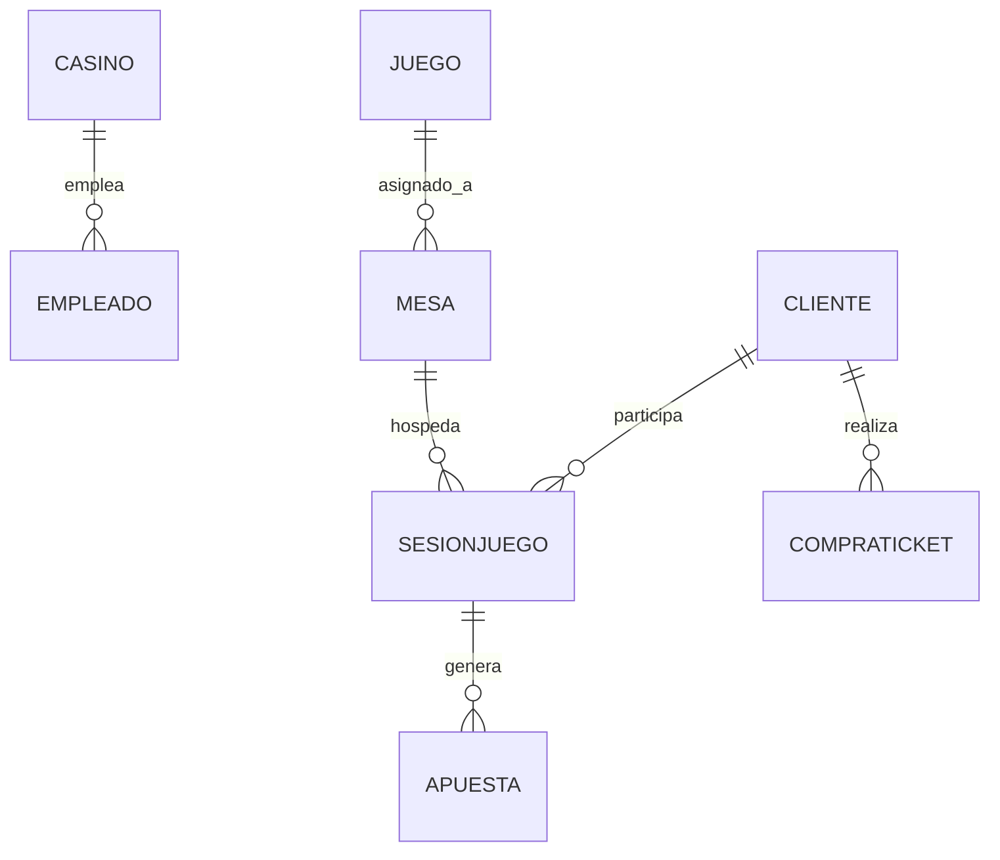

Este proyecto de referencia presenta el diseño e implementación de una base de datos relacional completa para un **casino hotelero**. El esquema cubre la gestión de mesas de juego, sesiones de clientes, registro de apuestas, administración de empleados y venta de servicios adicionales. Fue desarrollado como ejemplo guía dentro del curso **Bases de Datos Relacionales 2026-I** y puede servir como punto de partida o plantilla de comparación para los proyectos propios de los estudiantes.

<Note>
  Este proyecto fue diseñado originalmente para **MySQL**. Los tipos de dato `AUTO_INCREMENT`, la sintaxis de `FOREIGN KEY` inline y algunas funciones de fecha difieren en PostgreSQL. Para migrar el esquema, reemplaza `AUTO_INCREMENT` por `SERIAL` (o `GENERATED ALWAYS AS IDENTITY`), y ajusta los tipos `DATETIME` a `TIMESTAMP`.
</Note>

## Universo de Discurso

El casino hotelero opera con un identificador tributario único (`nitCasino`) y cuenta con una ubicación física y una capacidad máxima de clientes. La empresa gestiona una cartera de **juegos** (póker, ruleta, blackjack, etc.), cada uno con sus reglas y descripción. Los juegos se asignan a **mesas** físicas que tienen un número identificador, una capacidad máxima de jugadores y un estado operacional (activa, en mantenimiento, cerrada).

Los **clientes** se registran con sus datos personales y participan en **sesiones de juego** vinculadas a una mesa específica. Dentro de cada sesión, el cliente realiza una o varias **apuestas** de las que se registra el monto, la fecha y hora, el resultado y la ganancia obtenida. El casino también cuenta con **empleados** asignados a él y ofrece servicios adicionales que los clientes pueden adquirir mediante **compras de ticket**.

## Esquema Relacional

```sql
-- Tabla: casino
CREATE TABLE casino (
  nitCasino         INT          NOT NULL PRIMARY KEY,
  ubicacion         VARCHAR(255),
  capacidadClientes INT
);

-- Tabla: cliente
CREATE TABLE cliente (
  idCliente  INT          NOT NULL AUTO_INCREMENT PRIMARY KEY,
  cedCliente VARCHAR(20)  NOT NULL,
  nombre     VARCHAR(100) NOT NULL,
  apellido   VARCHAR(100) NOT NULL,
  telefono   VARCHAR(20),
  correo     VARCHAR(100),
  edad       INT
);

-- Tabla: juego
CREATE TABLE juego (
  idJuego     INT          NOT NULL AUTO_INCREMENT PRIMARY KEY,
  nombreJuego VARCHAR(100),
  descripcion TEXT,
  reglas      TEXT
);

-- Tabla: mesa
CREATE TABLE mesa (
  idMesa          INT         NOT NULL AUTO_INCREMENT PRIMARY KEY,
  numeroMesa      INT,
  capacidadMaxima INT,
  estado          VARCHAR(50),
  idJuego         INT,
  FOREIGN KEY (idJuego) REFERENCES juego(idJuego)
);

-- Tabla: sesionjuego
CREATE TABLE sesionjuego (
  idSesion        INT      NOT NULL AUTO_INCREMENT PRIMARY KEY,
  idCliente       INT,
  idMesa          INT,
  fechaHoraInicio DATETIME,
  fechaHoraFin    DATETIME,
  FOREIGN KEY (idCliente) REFERENCES cliente(idCliente),
  FOREIGN KEY (idMesa)    REFERENCES mesa(idMesa)
);

-- Tabla: apuesta
CREATE TABLE apuesta (
  idApuesta      INT            NOT NULL AUTO_INCREMENT PRIMARY KEY,
  idSesionJuego  INT,
  montoApuesta   DECIMAL(10,2),
  fechaHora      DATETIME,
  resultado      VARCHAR(50),
  montoGanancia  DECIMAL(10,2),
  FOREIGN KEY (idSesionJuego) REFERENCES sesionjuego(idSesion)
    ON UPDATE CASCADE
);

-- Tabla: empleado
CREATE TABLE empleado (
  idEmpleado  INT            NOT NULL AUTO_INCREMENT PRIMARY KEY,
  cedEmpleado VARCHAR(20),
  nombre      VARCHAR(100),
  apellido    VARCHAR(100),
  cargo       VARCHAR(50),
  salario     DECIMAL(10,2),
  idCasino    INT,
  FOREIGN KEY (idCasino) REFERENCES casino(nitCasino)
);

-- Tabla: compraticket (compras de servicios adicionales)
CREATE TABLE compraticket (
  idCompra   INT            NOT NULL AUTO_INCREMENT PRIMARY KEY,
  idCliente  INT,
  idServicio INT,
  fecha      DATETIME,
  monto      DECIMAL(10,2),
  FOREIGN KEY (idCliente) REFERENCES cliente(idCliente)
);
```

## Diagrama Entidad-Relación



## Consultas SQL de Referencia

Las siguientes consultas ilustran los patrones más comunes que deben cubrirse en el proyecto.

<Tabs>
  <Tab title="Agregación y ranking">
```sql
-- Clientes con más apuestas: ranking de actividad
SELECT
  c.nombre,
  c.apellido,
  COUNT(a.idApuesta)      AS total_apuestas,
  SUM(a.montoApuesta)     AS total_apostado,
  SUM(a.montoGanancia)    AS total_ganado,
  SUM(a.montoGanancia)
    - SUM(a.montoApuesta) AS ganancia_neta
FROM cliente c
JOIN sesionjuego s ON c.idCliente  = s.idCliente
JOIN apuesta     a ON s.idSesion   = a.idSesionJuego
GROUP BY c.idCliente, c.nombre, c.apellido
ORDER BY total_apuestas DESC;
```
  </Tab>
  <Tab title="JOINs múltiples">
```sql
-- Juego más popular medido por número de sesiones
SELECT
  j.nombreJuego,
  COUNT(s.idSesion) AS total_sesiones
FROM juego j
JOIN mesa       m ON j.idJuego = m.idJuego
JOIN sesionjuego s ON m.idMesa  = s.idMesa
GROUP BY j.idJuego, j.nombreJuego
ORDER BY total_sesiones DESC;

-- Mesas activas con su juego asignado y ocupación actual
SELECT
  m.numeroMesa,
  m.capacidadMaxima,
  m.estado,
  j.nombreJuego,
  COUNT(s.idSesion) AS sesiones_activas
FROM mesa m
JOIN juego j ON m.idJuego = j.idJuego
LEFT JOIN sesionjuego s
  ON m.idMesa = s.idMesa
  AND s.fechaHoraFin IS NULL   -- sesiones aún abiertas
WHERE m.estado = 'activa'
GROUP BY m.idMesa, m.numeroMesa, m.capacidadMaxima, m.estado, j.nombreJuego;
```
  </Tab>
  <Tab title="Subconsultas">
```sql
-- Clientes cuyo total apostado supera el promedio general
SELECT c.nombre, c.apellido, resumen.total_apostado
FROM cliente c
JOIN (
  SELECT s.idCliente,
         SUM(a.montoApuesta) AS total_apostado
  FROM sesionjuego s
  JOIN apuesta a ON s.idSesion = a.idSesionJuego
  GROUP BY s.idCliente
) AS resumen ON c.idCliente = resumen.idCliente
WHERE resumen.total_apostado > (
  SELECT AVG(sub.total_apostado)
  FROM (
    SELECT SUM(a2.montoApuesta) AS total_apostado
    FROM sesionjuego s2
    JOIN apuesta a2 ON s2.idSesion = a2.idSesionJuego
    GROUP BY s2.idCliente
  ) AS sub
)
ORDER BY resumen.total_apostado DESC;
```
  </Tab>
</Tabs>

## Diccionario de Datos

<AccordionGroup>
  <Accordion title="casino">
    | Columna | Tipo | Restricciones | Descripción |
    |---|---|---|---|
    | `nitCasino` | INT | PK, NOT NULL | Número de identificación tributaria del casino. Clave natural del negocio. |
    | `ubicacion` | VARCHAR(255) | — | Dirección física o descripción de la ubicación del establecimiento. |
    | `capacidadClientes` | INT | — | Número máximo de clientes que pueden estar simultáneamente en el casino. |
  </Accordion>

  <Accordion title="cliente">
    | Columna | Tipo | Restricciones | Descripción |
    |---|---|---|---|
    | `idCliente` | INT | PK, AUTO_INCREMENT | Identificador interno del cliente. |
    | `cedCliente` | VARCHAR(20) | NOT NULL | Número de cédula o documento de identidad del cliente. |
    | `nombre` | VARCHAR(100) | NOT NULL | Primer nombre del cliente. |
    | `apellido` | VARCHAR(100) | NOT NULL | Apellido del cliente. |
    | `telefono` | VARCHAR(20) | — | Número de contacto telefónico. |
    | `correo` | VARCHAR(100) | — | Correo electrónico del cliente. |
    | `edad` | INT | — | Edad del cliente en años. Se recomienda agregar `CHECK (edad >= 18)` para cumplir regulación. |
  </Accordion>

  <Accordion title="juego">
    | Columna | Tipo | Restricciones | Descripción |
    |---|---|---|---|
    | `idJuego` | INT | PK, AUTO_INCREMENT | Identificador del tipo de juego. |
    | `nombreJuego` | VARCHAR(100) | — | Nombre del juego (ej. Blackjack, Ruleta, Póker). |
    | `descripcion` | TEXT | — | Descripción general del juego. |
    | `reglas` | TEXT | — | Reglamento detallado del juego. |
  </Accordion>

  <Accordion title="mesa">
    | Columna | Tipo | Restricciones | Descripción |
    |---|---|---|---|
    | `idMesa` | INT | PK, AUTO_INCREMENT | Identificador interno de la mesa. |
    | `numeroMesa` | INT | — | Número visible de la mesa en el piso del casino. |
    | `capacidadMaxima` | INT | — | Máximo de jugadores simultáneos en la mesa. |
    | `estado` | VARCHAR(50) | — | Estado operacional: `activa`, `en mantenimiento`, `cerrada`. |
    | `idJuego` | INT | FK → juego | Juego asignado a la mesa. |
  </Accordion>

  <Accordion title="sesionjuego">
    | Columna | Tipo | Restricciones | Descripción |
    |---|---|---|---|
    | `idSesion` | INT | PK, AUTO_INCREMENT | Identificador de la sesión de juego. |
    | `idCliente` | INT | FK → cliente | Cliente que participa en la sesión. |
    | `idMesa` | INT | FK → mesa | Mesa en la que se desarrolla la sesión. |
    | `fechaHoraInicio` | DATETIME | — | Marca de tiempo de inicio de la sesión. |
    | `fechaHoraFin` | DATETIME | — | Marca de tiempo de fin; `NULL` si la sesión está activa. |
  </Accordion>

  <Accordion title="apuesta">
    | Columna | Tipo | Restricciones | Descripción |
    |---|---|---|---|
    | `idApuesta` | INT | PK, AUTO_INCREMENT | Identificador de la apuesta. |
    | `idSesionJuego` | INT | FK → sesionjuego (ON UPDATE CASCADE) | Sesión en la que se realizó la apuesta. |
    | `montoApuesta` | DECIMAL(10,2) | — | Valor monetario apostado. |
    | `fechaHora` | DATETIME | — | Fecha y hora exacta de la apuesta. |
    | `resultado` | VARCHAR(50) | — | Resultado de la apuesta: `ganada`, `perdida`, `empate`. |
    | `montoGanancia` | DECIMAL(10,2) | — | Monto recibido por el cliente si ganó; `0` o `NULL` si perdió. |
  </Accordion>

  <Accordion title="empleado">
    | Columna | Tipo | Restricciones | Descripción |
    |---|---|---|---|
    | `idEmpleado` | INT | PK, AUTO_INCREMENT | Identificador interno del empleado. |
    | `cedEmpleado` | VARCHAR(20) | — | Cédula o documento de identidad del empleado. |
    | `nombre` | VARCHAR(100) | — | Primer nombre del empleado. |
    | `apellido` | VARCHAR(100) | — | Apellido del empleado. |
    | `cargo` | VARCHAR(50) | — | Cargo o rol desempeñado (ej. crupier, supervisor, cajero). |
    | `salario` | DECIMAL(10,2) | — | Salario mensual del empleado. |
    | `idCasino` | INT | FK → casino | Casino al que está asignado el empleado. |
  </Accordion>

  <Accordion title="compraticket">
    | Columna | Tipo | Restricciones | Descripción |
    |---|---|---|---|
    | `idCompra` | INT | PK, AUTO_INCREMENT | Identificador de la transacción de compra. |
    | `idCliente` | INT | FK → cliente | Cliente que realiza la compra. |
    | `idServicio` | INT | — | Identificador del servicio adquirido (referencia a tabla de servicios no incluida en este fragmento). |
    | `fecha` | DATETIME | — | Fecha y hora de la compra. |
    | `monto` | DECIMAL(10,2) | — | Valor pagado por el servicio. |
  </Accordion>
</AccordionGroup>

## Posibles Extensiones del Esquema

<CardGroup cols={2}>
  <Card title="Tabla de Servicios" icon="concierge-bell">
    Agregar una tabla `servicio(idServicio, nombreServicio, descripcion, precio)` y enlazarla correctamente con `compraticket` mediante FK para resolver la referencia actualmente implícita.
  </Card>
  <Card title="Restricción de Edad" icon="shield-halved">
    Añadir `CHECK (edad >= 18)` en la tabla `cliente` para garantizar que el sistema no admita menores de edad, cumpliendo la regulación de casinos en Colombia.
  </Card>
  <Card title="Historial de Estados de Mesa" icon="clock-rotate-left">
    Crear una tabla `historial_estado_mesa(id, idMesa, estado, fechaCambio, motivo)` para auditar los cambios de estado y calcular tiempos de disponibilidad.
  </Card>
  <Card title="Integración pgvector" icon="magnifying-glass">
    Agregar una columna `embedding vector(384)` en la tabla `juego` para permitir búsqueda semántica de juegos similares a partir de su descripción o reglas en lenguaje natural.
  </Card>
</CardGroup>
