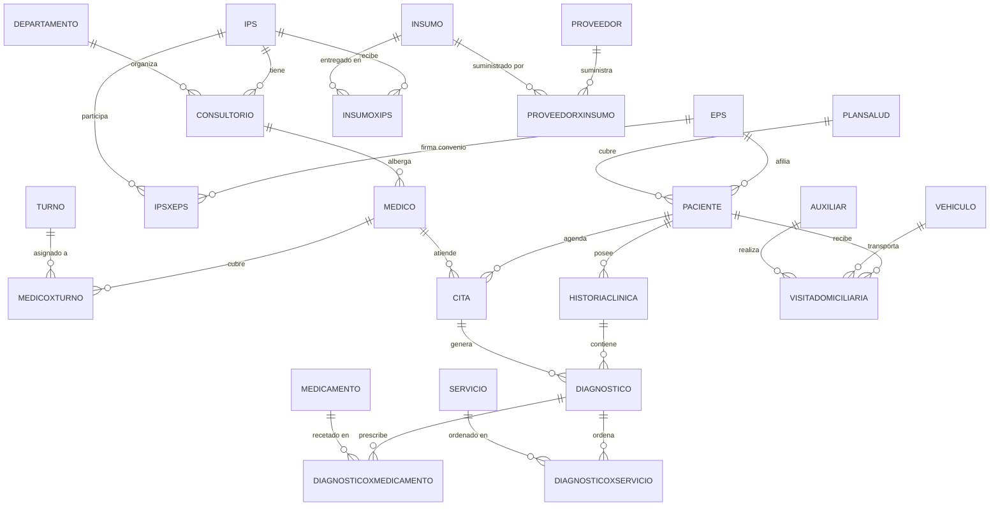

Este proyecto de referencia presenta el modelado e implementación de una base de datos relacional para una **EPS colombiana (Entidad Promotora de Salud)**. El esquema abarca la afiliación de pacientes con su plan de salud, la red de clínicas IPS organizadas por consultorio y departamento, el cuerpo médico con sus turnos, la programación de citas, el historial clínico con diagnósticos vinculados a medicamentos y servicios, y las visitas domiciliarias atendidas por auxiliares. Fue construido como ejemplo guía del curso **Bases de Datos Relacionales 2026-I** y está acompañado por un contraejemplo en MongoDB para comparar los enfoques relacional y documental sobre el mismo dominio.

<Note>
  Este proyecto fue diseñado originalmente para **MySQL**. Los tipos `AUTO_INCREMENT`, `DATE` y `TIME` como columnas separadas y las restricciones `ON DELETE CASCADE` son compatibles con MySQL 8. Para migrar a PostgreSQL reemplaza `AUTO_INCREMENT` por `SERIAL` y ajusta las restricciones de cascada según el comportamiento deseado.
</Note>

## Universo de Discurso

Una EPS actúa como aseguradora de salud: ofrece **planes de salud** a sus **pacientes** afiliados y coordina una red de **IPS** (Instituciones Prestadoras de Servicios). Cada IPS alberga **consultorios** organizados en **departamentos** clínicos (medicina general, cardiología, pediatría, etc.). Los **médicos** ejercen en un consultorio y cubren **turnos** programados. Los pacientes agendan **citas** con médicos, cuyo resultado genera un **diagnóstico** que puede prescribir **medicamentos** y ordenar **servicios** médicos. El sistema registra también **visitas domiciliarias** con un **auxiliar** y un **vehículo** asignado para atender pacientes con movilidad reducida.

La gestión de insumos cierra el ciclo operativo: los **proveedores** suministran **insumos** a las IPS mediante registros `InsumoxIps`, y cada entrega queda vinculada al proveedor en `ProveedorxInsumo`. La relación entre IPS y EPS se formaliza en `IpsxEps` mediante un tipo de convenio.

## Esquema Relacional

```sql
-- ──────────────────────────────────────────────
-- Tablas maestras independientes
-- ──────────────────────────────────────────────

-- Tabla: Proveedor
CREATE TABLE Proveedor (
    idProveedor INT AUTO_INCREMENT,
    nombre      VARCHAR(100),
    apellidos   VARCHAR(100),
    direccion   VARCHAR(255),
    telefono    VARCHAR(15),
    correo      VARCHAR(100),
    CONSTRAINT PK_PROVEEDOR PRIMARY KEY (idProveedor)
) AUTO_INCREMENT = 1001;

-- Tabla: Insumo
CREATE TABLE Insumo (
    idInsumo      INT AUTO_INCREMENT,
    nombre        VARCHAR(100),
    descripcion   TEXT,
    tipoInsumo    VARCHAR(50),
    cantidad      INT,
    unidadMedida  VARCHAR(50),
    CONSTRAINT PK_INSUMO PRIMARY KEY (idInsumo)
) AUTO_INCREMENT = 2001;

-- Tabla: Ips
CREATE TABLE Ips (
    idIps     INT AUTO_INCREMENT,
    nombre    VARCHAR(100),
    direccion VARCHAR(255),
    telefono  VARCHAR(15),
    correo    VARCHAR(100),
    CONSTRAINT PK_IPS PRIMARY KEY (idIps)
) AUTO_INCREMENT = 4001;

-- Tabla: Eps
CREATE TABLE Eps (
    idEps       INT AUTO_INCREMENT,
    nombre      VARCHAR(100),
    tipoEntidad VARCHAR(50),
    direccion   VARCHAR(255),
    telefono    VARCHAR(15),
    correo      VARCHAR(100),
    CONSTRAINT PK_EPS PRIMARY KEY (idEps)
) AUTO_INCREMENT = 6001;

-- Tabla: Departamento (departamento clínico interno de la IPS)
CREATE TABLE Departamento (
    idDepartamento INT AUTO_INCREMENT,
    nombre         VARCHAR(100),
    especialidad   VARCHAR(100),
    descripcion    TEXT,
    CONSTRAINT PK_DEPARTAMENTO PRIMARY KEY (idDepartamento)
) AUTO_INCREMENT = 8001;

-- Tabla: PlanSalud
CREATE TABLE PlanSalud (
    idPlanSalud INT AUTO_INCREMENT,
    precio      INT,
    tipo        VARCHAR(100),
    CONSTRAINT PK_PLANSALUD PRIMARY KEY (idPlanSalud)
) AUTO_INCREMENT = 19001;

-- Tabla: Medicamento
CREATE TABLE Medicamento (
    idMedicamento    INT AUTO_INCREMENT,
    nombre           VARCHAR(100),
    cantidad_mg      INT,
    viaAdministracion VARCHAR(100),
    CONSTRAINT PK_MEDICAMENTO PRIMARY KEY (idMedicamento)
) AUTO_INCREMENT = 17001;

-- Tabla: Servicio
CREATE TABLE Servicio (
    idServicio  INT AUTO_INCREMENT,
    nombre      VARCHAR(100),
    descripcion TEXT,
    CONSTRAINT PK_SERVICIO PRIMARY KEY (idServicio)
) AUTO_INCREMENT = 18001;

-- Tabla: Vehiculo
CREATE TABLE Vehiculo (
    placaVehiculo VARCHAR(20),
    equipamiento  VARCHAR(255),
    CONSTRAINT PK_VEHICULO PRIMARY KEY (placaVehiculo)
);

-- Tabla: Auxiliar
CREATE TABLE Auxiliar (
    idAuxiliar INT AUTO_INCREMENT,
    nombre     VARCHAR(100),
    apellidos  VARCHAR(100),
    telefono   VARCHAR(15),
    correo     VARCHAR(100),
    CONSTRAINT PK_AUXILIAR PRIMARY KEY (idAuxiliar)
) AUTO_INCREMENT = 22001;

-- Tabla: Turno
CREATE TABLE Turno (
    idTurno    INT AUTO_INCREMENT,
    horaInicio TIME,
    horaFin    TIME,
    CONSTRAINT PK_TURNO PRIMARY KEY (idTurno)
) AUTO_INCREMENT = 24001;

-- ──────────────────────────────────────────────
-- Tablas de relación y dependientes
-- ──────────────────────────────────────────────

-- Tabla: ProveedorxInsumo
CREATE TABLE ProveedorxInsumo (
    idProveedorxInsumo INT AUTO_INCREMENT,
    idProveedor        INT NOT NULL,
    idInsumo           INT,
    cantidad           INT,
    fecha              DATE,
    CONSTRAINT PK_PROVEEDORXINSUMO PRIMARY KEY (idProveedorxInsumo),
    CONSTRAINT FK_PXI_PROVEEDOR FOREIGN KEY (idProveedor) REFERENCES Proveedor(idProveedor)
        ON DELETE CASCADE ON UPDATE CASCADE,
    CONSTRAINT FK_PXI_INSUMO    FOREIGN KEY (idInsumo)    REFERENCES Insumo(idInsumo)
        ON DELETE CASCADE ON UPDATE CASCADE
) AUTO_INCREMENT = 3001;

-- Tabla: InsumoxIps
CREATE TABLE InsumoxIps (
    idInsumoxIps   INT AUTO_INCREMENT,
    idInsumo       INT  NOT NULL,
    idIps          INT  NOT NULL,
    fechaEntrega   DATE,
    estadoEntrega  VARCHAR(50),
    CONSTRAINT PK_INSUMOXIPS PRIMARY KEY (idInsumoxIps),
    CONSTRAINT FK_IXIPS_INSUMO FOREIGN KEY (idInsumo) REFERENCES Insumo(idInsumo)
        ON DELETE CASCADE ON UPDATE CASCADE,
    CONSTRAINT FK_IXIPS_IPS    FOREIGN KEY (idIps)    REFERENCES Ips(idIps)
        ON DELETE CASCADE ON UPDATE CASCADE
) AUTO_INCREMENT = 5001;

-- Tabla: IpsxEps
CREATE TABLE IpsxEps (
    idIpsxEps    INT AUTO_INCREMENT,
    idIps        INT NOT NULL,
    idEps        INT NOT NULL,
    tipoConvenio VARCHAR(100),
    CONSTRAINT PK_IPSXEPS PRIMARY KEY (idIpsxEps),
    CONSTRAINT FK_IXE_IPS FOREIGN KEY (idIps) REFERENCES Ips(idIps)
        ON DELETE CASCADE ON UPDATE CASCADE,
    CONSTRAINT FK_IXE_EPS FOREIGN KEY (idEps) REFERENCES Eps(idEps)
        ON DELETE CASCADE ON UPDATE CASCADE
) AUTO_INCREMENT = 7001;

-- Tabla: Consultorio
CREATE TABLE Consultorio (
    idConsultorio  INT AUTO_INCREMENT,
    idIps          INT NOT NULL,
    idDepartamento INT NOT NULL,
    localizacion   VARCHAR(255),
    CONSTRAINT PK_CONSULTORIO PRIMARY KEY (idConsultorio),
    CONSTRAINT FK_CONSULTORIO_IPS         FOREIGN KEY (idIps)          REFERENCES Ips(idIps)
        ON UPDATE CASCADE ON DELETE CASCADE,
    CONSTRAINT FK_CONSULTORIO_DEPARTAMENTO FOREIGN KEY (idDepartamento) REFERENCES Departamento(idDepartamento)
        ON UPDATE CASCADE ON DELETE CASCADE
) AUTO_INCREMENT = 9001;

-- Tabla: Medico
CREATE TABLE Medico (
    idMedico      INT AUTO_INCREMENT,
    idConsultorio INT NOT NULL,
    nombre        VARCHAR(100),
    apellidos     VARCHAR(100),
    especialidad  VARCHAR(100),
    telefono      VARCHAR(15),
    correo        VARCHAR(100),
    CONSTRAINT PK_MEDICO PRIMARY KEY (idMedico),
    CONSTRAINT FK_MEDICO_CONSULTORIO FOREIGN KEY (idConsultorio) REFERENCES Consultorio(idConsultorio)
        ON DELETE CASCADE ON UPDATE CASCADE
) AUTO_INCREMENT = 13001;

-- Tabla: Paciente
CREATE TABLE Paciente (
    idPaciente  INT AUTO_INCREMENT,
    idEps       INT NOT NULL,
    idPlanSalud INT NOT NULL,
    nombre      VARCHAR(100),
    apellidos   VARCHAR(100),
    edad        INT,
    genero      VARCHAR(15),
    telefono    VARCHAR(15),
    direccion   VARCHAR(255),
    correo      VARCHAR(100),
    CONSTRAINT PK_PACIENTE PRIMARY KEY (idPaciente),
    CONSTRAINT FK_PACIENTE_EPS       FOREIGN KEY (idEps)       REFERENCES Eps(idEps)
        ON DELETE CASCADE ON UPDATE CASCADE,
    CONSTRAINT FK_PACIENTE_PLANSALUD FOREIGN KEY (idPlanSalud) REFERENCES PlanSalud(idPlanSalud)
        ON DELETE CASCADE ON UPDATE CASCADE
) AUTO_INCREMENT = 14001;

-- Tabla: Cita
CREATE TABLE Cita (
    idCita     INT AUTO_INCREMENT,
    idMedico   INT NOT NULL,
    idPaciente INT NOT NULL,
    fecha      DATE,
    hora       TIME,
    motivo     TEXT,
    CONSTRAINT PK_CITA PRIMARY KEY (idCita),
    CONSTRAINT FK_CITA_MEDICO   FOREIGN KEY (idMedico)   REFERENCES Medico(idMedico)
        ON DELETE CASCADE ON UPDATE CASCADE,
    CONSTRAINT FK_CITA_PACIENTE FOREIGN KEY (idPaciente) REFERENCES Paciente(idPaciente)
        ON DELETE CASCADE ON UPDATE CASCADE
) AUTO_INCREMENT = 15001;

-- Tabla: HistoriaClinica
CREATE TABLE HistoriaClinica (
    idHistoriaClinica INT AUTO_INCREMENT,
    idPaciente        INT NOT NULL,
    fecha_creacion    DATE,
    CONSTRAINT PK_HISTORIACLINICA PRIMARY KEY (idHistoriaClinica),
    CONSTRAINT FK_HC_PACIENTE FOREIGN KEY (idPaciente) REFERENCES Paciente(idPaciente)
        ON DELETE CASCADE ON UPDATE CASCADE
) AUTO_INCREMENT = 21001;

-- Tabla: Diagnostico
CREATE TABLE Diagnostico (
    idDiagnostico     INT AUTO_INCREMENT,
    idHistoriaClinica INT,
    idCita            INT,
    descripcion       TEXT,
    tratamiento       TEXT,
    CONSTRAINT PK_DIAGNOSTICO PRIMARY KEY (idDiagnostico),
    CONSTRAINT FK_DIAGNOSTICO_HISTORIACLINICA FOREIGN KEY (idHistoriaClinica)
        REFERENCES HistoriaClinica(idHistoriaClinica) ON DELETE CASCADE ON UPDATE CASCADE,
    CONSTRAINT FK_DIAGNOSTICO_CITA           FOREIGN KEY (idCita)
        REFERENCES Cita(idCita)               ON DELETE CASCADE ON UPDATE CASCADE
) AUTO_INCREMENT = 16001;

-- Tabla: DiagnosticoxMedicamento
CREATE TABLE DiagnosticoxMedicamento (
    idDiagnostico INT,
    idMedicamento INT,
    fecha         DATE,
    cantidad      INT,
    CONSTRAINT PK_DIAGNOSTICOXMEDICAMENTO
        PRIMARY KEY (idDiagnostico, idMedicamento, fecha),
    CONSTRAINT FK_DXM_DIAGNOSTICO FOREIGN KEY (idDiagnostico) REFERENCES Diagnostico(idDiagnostico)
        ON DELETE CASCADE ON UPDATE CASCADE,
    CONSTRAINT FK_DXM_MEDICAMENTO FOREIGN KEY (idMedicamento) REFERENCES Medicamento(idMedicamento)
        ON DELETE CASCADE ON UPDATE CASCADE
);

-- Tabla: DiagnosticoxServicio
CREATE TABLE DiagnosticoxServicio (
    idDiagnostico INT,
    idServicio    INT,
    fecha         DATE,
    descripcion   TEXT,
    CONSTRAINT PK_DIAGNOSTICOXSERVICIO
        PRIMARY KEY (idDiagnostico, idServicio, fecha),
    CONSTRAINT FK_DXS_DIAGNOSTICO FOREIGN KEY (idDiagnostico) REFERENCES Diagnostico(idDiagnostico)
        ON DELETE CASCADE ON UPDATE CASCADE,
    CONSTRAINT FK_DXS_SERVICIO    FOREIGN KEY (idServicio)    REFERENCES Servicio(idServicio)
        ON DELETE CASCADE ON UPDATE CASCADE
);

-- Tabla: VisitaDomiciliaria
CREATE TABLE VisitaDomiciliaria (
    idVisita      INT AUTO_INCREMENT,
    idPaciente    INT,
    placaVehiculo VARCHAR(20),
    idAuxiliar    INT,
    motivo        TEXT,
    fecha         DATE,
    reporte       TEXT,
    CONSTRAINT PK_VISITADOMICILIARIA PRIMARY KEY (idVisita),
    CONSTRAINT FK_VD_VEHICULO  FOREIGN KEY (placaVehiculo) REFERENCES Vehiculo(placaVehiculo)
        ON DELETE CASCADE ON UPDATE CASCADE,
    CONSTRAINT FK_VD_AUXILIAR  FOREIGN KEY (idAuxiliar)   REFERENCES Auxiliar(idAuxiliar)
        ON DELETE CASCADE ON UPDATE CASCADE,
    CONSTRAINT FK_VD_PACIENTE  FOREIGN KEY (idPaciente)   REFERENCES Paciente(idPaciente)
        ON DELETE CASCADE ON UPDATE CASCADE
) AUTO_INCREMENT = 23001;

-- Tabla: MedicoxTurno
CREATE TABLE MedicoxTurno (
    idMedico INT,
    idTurno  INT,
    fecha    DATE,
    CONSTRAINT PK_MEDICOXTURNO PRIMARY KEY (idMedico, idTurno, fecha),
    CONSTRAINT FK_MXT_MEDICO FOREIGN KEY (idMedico) REFERENCES Medico(idMedico)
        ON DELETE CASCADE ON UPDATE CASCADE,
    CONSTRAINT FK_MXT_TURNO  FOREIGN KEY (idTurno)  REFERENCES Turno(idTurno)
        ON DELETE CASCADE ON UPDATE CASCADE
);
```

## Diagrama Entidad-Relación



## Consultas SQL de Referencia

<Tabs>
  <Tab title="Reportes de citas">
```sql
-- Citas por médico y especialidad
SELECT
  CONCAT(m.nombre, ' ', m.apellidos) AS medico,
  m.especialidad,
  COUNT(c.idCita)                     AS total_citas
FROM Medico m
LEFT JOIN Cita c ON m.idMedico = c.idMedico
GROUP BY m.idMedico, m.nombre, m.apellidos, m.especialidad
ORDER BY total_citas DESC;

-- Citas programadas para una fecha específica
SELECT
  CONCAT(p.nombre, ' ', p.apellidos) AS paciente,
  CONCAT(m.nombre, ' ', m.apellidos) AS medico,
  m.especialidad,
  c.fecha,
  c.hora,
  c.motivo
FROM Cita c
JOIN Paciente p ON c.idPaciente = p.idPaciente
JOIN Medico   m ON c.idMedico   = m.idMedico
WHERE c.fecha = '2026-03-15'
ORDER BY c.hora;
```
  </Tab>
  <Tab title="Diagnósticos y medicamentos">
```sql
-- Medicamentos más prescritos
SELECT
  med.nombre,
  med.viaAdministracion,
  COUNT(dxm.idDiagnostico) AS veces_prescrito,
  SUM(dxm.cantidad)        AS cantidad_total_mg
FROM Medicamento med
JOIN DiagnosticoxMedicamento dxm ON med.idMedicamento = dxm.idMedicamento
GROUP BY med.idMedicamento, med.nombre, med.viaAdministracion
ORDER BY veces_prescrito DESC;

-- Historia clínica completa de un paciente
SELECT
  hc.idHistoriaClinica,
  hc.fecha_creacion,
  d.descripcion  AS diagnostico,
  d.tratamiento,
  c.fecha        AS fecha_cita,
  c.hora
FROM HistoriaClinica hc
JOIN Diagnostico d ON hc.idHistoriaClinica = d.idHistoriaClinica
JOIN Cita        c ON d.idCita             = c.idCita
WHERE hc.idPaciente = 14001
ORDER BY c.fecha DESC, c.hora DESC;
```
  </Tab>
  <Tab title="Visitas domiciliarias">
```sql
-- Pacientes con más visitas domiciliarias
SELECT
  CONCAT(p.nombre, ' ', p.apellidos) AS paciente,
  COUNT(v.idVisita)                   AS total_visitas
FROM Paciente p
JOIN VisitaDomiciliaria v ON p.idPaciente = v.idPaciente
GROUP BY p.idPaciente, p.nombre, p.apellidos
HAVING COUNT(v.idVisita) > 1
ORDER BY total_visitas DESC;

-- Auxiliares con mayor carga de visitas en el mes actual
SELECT
  CONCAT(a.nombre, ' ', a.apellidos) AS auxiliar,
  COUNT(v.idVisita)                   AS visitas_mes
FROM Auxiliar a
JOIN VisitaDomiciliaria v ON a.idAuxiliar = v.idAuxiliar
WHERE MONTH(v.fecha) = MONTH(CURDATE())
  AND YEAR(v.fecha)  = YEAR(CURDATE())
GROUP BY a.idAuxiliar, a.nombre, a.apellidos
ORDER BY visitas_mes DESC;
```
  </Tab>
  <Tab title="Cobertura e insumos">
```sql
-- IPS con mayor número de médicos por departamento clínico
SELECT
  d.nombre          AS departamento,
  d.especialidad,
  i.nombre          AS ips,
  COUNT(m.idMedico) AS num_medicos
FROM Departamento d
JOIN Consultorio c ON d.idDepartamento = c.idDepartamento
JOIN Ips         i ON c.idIps          = i.idIps
JOIN Medico      m ON c.idConsultorio  = m.idConsultorio
GROUP BY d.idDepartamento, d.nombre, d.especialidad, i.idIps, i.nombre
ORDER BY num_medicos DESC;

-- Insumos con stock bajo (menos de 10 unidades)
SELECT
  ins.nombre,
  ins.tipoInsumo,
  ins.cantidad,
  ins.unidadMedida
FROM Insumo ins
WHERE ins.cantidad < 10
ORDER BY ins.cantidad ASC;
```
  </Tab>
</Tabs>

## Diccionario de Datos

<AccordionGroup>
  <Accordion title="Eps — Entidad Promotora de Salud">
    | Columna | Tipo | Restricciones | Descripción |
    |---|---|---|---|
    | `idEps` | INT | PK, AUTO_INCREMENT (desde 6001) | Identificador interno de la EPS. |
    | `nombre` | VARCHAR(100) | — | Razón social de la EPS. |
    | `tipoEntidad` | VARCHAR(50) | — | Tipo de entidad: `pública`, `privada`, `mixta`. |
    | `direccion` | VARCHAR(255) | — | Dirección de la sede principal. |
    | `telefono` | VARCHAR(15) | — | Número de contacto general. |
    | `correo` | VARCHAR(100) | — | Correo electrónico institucional. |
  </Accordion>

  <Accordion title="PlanSalud — Plan de cobertura">
    | Columna | Tipo | Restricciones | Descripción |
    |---|---|---|---|
    | `idPlanSalud` | INT | PK, AUTO_INCREMENT (desde 19001) | Identificador del plan de salud. |
    | `precio` | INT | — | Valor mensual del plan en pesos colombianos. |
    | `tipo` | VARCHAR(100) | — | Nombre o categoría del plan (ej. básico, complementario). |
  </Accordion>

  <Accordion title="Ips — Institución Prestadora de Servicios">
    | Columna | Tipo | Restricciones | Descripción |
    |---|---|---|---|
    | `idIps` | INT | PK, AUTO_INCREMENT (desde 4001) | Identificador de la IPS. |
    | `nombre` | VARCHAR(100) | — | Nombre de la clínica u hospital. |
    | `direccion` | VARCHAR(255) | — | Dirección física de la IPS. |
    | `telefono` | VARCHAR(15) | — | Número de contacto de la IPS. |
    | `correo` | VARCHAR(100) | — | Correo electrónico de la IPS. |
  </Accordion>

  <Accordion title="IpsxEps — Convenio entre IPS y EPS">
    | Columna | Tipo | Restricciones | Descripción |
    |---|---|---|---|
    | `idIpsxEps` | INT | PK, AUTO_INCREMENT (desde 7001) | Identificador del convenio. |
    | `idIps` | INT | FK → Ips, NOT NULL | IPS que firma el convenio. |
    | `idEps` | INT | FK → Eps, NOT NULL | EPS que firma el convenio. |
    | `tipoConvenio` | VARCHAR(100) | — | Tipo de convenio (ej. pleno, parcial, urgencias). |
  </Accordion>

  <Accordion title="Departamento — Departamento clínico de la IPS">
    | Columna | Tipo | Restricciones | Descripción |
    |---|---|---|---|
    | `idDepartamento` | INT | PK, AUTO_INCREMENT (desde 8001) | Identificador del departamento clínico. |
    | `nombre` | VARCHAR(100) | — | Nombre del departamento (ej. Medicina General, Cardiología). |
    | `especialidad` | VARCHAR(100) | — | Especialidad médica principal del departamento. |
    | `descripcion` | TEXT | — | Descripción de los servicios que presta el departamento. |
  </Accordion>

  <Accordion title="Consultorio — Espacio físico de atención">
    | Columna | Tipo | Restricciones | Descripción |
    |---|---|---|---|
    | `idConsultorio` | INT | PK, AUTO_INCREMENT (desde 9001) | Identificador del consultorio. |
    | `idIps` | INT | FK → Ips, NOT NULL | IPS a la que pertenece el consultorio. |
    | `idDepartamento` | INT | FK → Departamento, NOT NULL | Departamento clínico al que pertenece. |
    | `localizacion` | VARCHAR(255) | — | Ubicación dentro de la IPS (piso, ala, número de sala). |
  </Accordion>

  <Accordion title="Medico — Personal médico">
    | Columna | Tipo | Restricciones | Descripción |
    |---|---|---|---|
    | `idMedico` | INT | PK, AUTO_INCREMENT (desde 13001) | Identificador del médico. |
    | `idConsultorio` | INT | FK → Consultorio, NOT NULL | Consultorio donde ejerce el médico. |
    | `nombre` | VARCHAR(100) | — | Nombre del médico. |
    | `apellidos` | VARCHAR(100) | — | Apellidos del médico. |
    | `especialidad` | VARCHAR(100) | — | Especialidad médica (ej. Cardiología, Pediatría). |
    | `telefono` | VARCHAR(15) | — | Número de contacto del médico. |
    | `correo` | VARCHAR(100) | — | Correo electrónico del médico. |
  </Accordion>

  <Accordion title="Turno — Turno de trabajo médico">
    | Columna | Tipo | Restricciones | Descripción |
    |---|---|---|---|
    | `idTurno` | INT | PK, AUTO_INCREMENT (desde 24001) | Identificador del turno. |
    | `horaInicio` | TIME | — | Hora de inicio del turno. |
    | `horaFin` | TIME | — | Hora de finalización del turno. |
  </Accordion>

  <Accordion title="MedicoxTurno — Asignación de turnos a médicos">
    | Columna | Tipo | Restricciones | Descripción |
    |---|---|---|---|
    | `idMedico` | INT | PK (compuesta), FK → Medico | Médico asignado al turno. |
    | `idTurno` | INT | PK (compuesta), FK → Turno | Turno asignado. |
    | `fecha` | DATE | PK (compuesta) | Fecha en la que el médico cubre el turno. |
  </Accordion>

  <Accordion title="Paciente — Afiliado a la EPS">
    | Columna | Tipo | Restricciones | Descripción |
    |---|---|---|---|
    | `idPaciente` | INT | PK, AUTO_INCREMENT (desde 14001) | Identificador del paciente. |
    | `idEps` | INT | FK → Eps, NOT NULL | EPS a la que está afiliado el paciente. |
    | `idPlanSalud` | INT | FK → PlanSalud, NOT NULL | Plan de salud del paciente. |
    | `nombre` | VARCHAR(100) | — | Nombre del paciente. |
    | `apellidos` | VARCHAR(100) | — | Apellidos del paciente. |
    | `edad` | INT | — | Edad del paciente en años. |
    | `genero` | VARCHAR(15) | — | Género del paciente. |
    | `telefono` | VARCHAR(15) | — | Número de contacto del paciente o acudiente. |
    | `direccion` | VARCHAR(255) | — | Dirección de residencia del paciente. |
    | `correo` | VARCHAR(100) | — | Correo electrónico del paciente. |
  </Accordion>

  <Accordion title="Cita — Cita médica programada">
    | Columna | Tipo | Restricciones | Descripción |
    |---|---|---|---|
    | `idCita` | INT | PK, AUTO_INCREMENT (desde 15001) | Identificador de la cita. |
    | `idMedico` | INT | FK → Medico, NOT NULL | Médico que atiende la cita. |
    | `idPaciente` | INT | FK → Paciente, NOT NULL | Paciente que solicita la cita. |
    | `fecha` | DATE | — | Fecha programada para la cita. |
    | `hora` | TIME | — | Hora programada para la cita. |
    | `motivo` | TEXT | — | Motivo de consulta registrado al agendar. |
  </Accordion>

  <Accordion title="HistoriaClinica — Registro médico del paciente">
    | Columna | Tipo | Restricciones | Descripción |
    |---|---|---|---|
    | `idHistoriaClinica` | INT | PK, AUTO_INCREMENT (desde 21001) | Identificador de la historia clínica. |
    | `idPaciente` | INT | FK → Paciente, NOT NULL | Paciente al que pertenece la historia. |
    | `fecha_creacion` | DATE | — | Fecha en que se creó la historia clínica. |
  </Accordion>

  <Accordion title="Diagnostico — Diagnóstico médico">
    | Columna | Tipo | Restricciones | Descripción |
    |---|---|---|---|
    | `idDiagnostico` | INT | PK, AUTO_INCREMENT (desde 16001) | Identificador del diagnóstico. |
    | `idHistoriaClinica` | INT | FK → HistoriaClinica | Historia clínica a la que pertenece. |
    | `idCita` | INT | FK → Cita | Cita en la que se emitió el diagnóstico. |
    | `descripcion` | TEXT | — | Descripción clínica del diagnóstico. |
    | `tratamiento` | TEXT | — | Plan de tratamiento indicado por el médico. |
  </Accordion>

  <Accordion title="Medicamento — Catálogo farmacológico">
    | Columna | Tipo | Restricciones | Descripción |
    |---|---|---|---|
    | `idMedicamento` | INT | PK, AUTO_INCREMENT (desde 17001) | Identificador del medicamento. |
    | `nombre` | VARCHAR(100) | — | Nombre comercial del medicamento. |
    | `cantidad_mg` | INT | — | Dosis estándar en miligramos. |
    | `viaAdministracion` | VARCHAR(100) | — | Vía de administración: `oral`, `intravenosa`, `tópica`, etc. |
  </Accordion>

  <Accordion title="DiagnosticoxMedicamento — Prescripción">
    | Columna | Tipo | Restricciones | Descripción |
    |---|---|---|---|
    | `idDiagnostico` | INT | PK (compuesta), FK → Diagnostico | Diagnóstico que genera la prescripción. |
    | `idMedicamento` | INT | PK (compuesta), FK → Medicamento | Medicamento prescrito. |
    | `fecha` | DATE | PK (compuesta) | Fecha de la prescripción. |
    | `cantidad` | INT | — | Cantidad de unidades prescritas. |
  </Accordion>

  <Accordion title="Servicio — Servicios médicos disponibles">
    | Columna | Tipo | Restricciones | Descripción |
    |---|---|---|---|
    | `idServicio` | INT | PK, AUTO_INCREMENT (desde 18001) | Identificador del servicio. |
    | `nombre` | VARCHAR(100) | — | Nombre del servicio (ej. Laboratorio clínico, Rayos X). |
    | `descripcion` | TEXT | — | Descripción detallada del servicio médico. |
  </Accordion>

  <Accordion title="DiagnosticoxServicio — Servicio ordenado">
    | Columna | Tipo | Restricciones | Descripción |
    |---|---|---|---|
    | `idDiagnostico` | INT | PK (compuesta), FK → Diagnostico | Diagnóstico que ordena el servicio. |
    | `idServicio` | INT | PK (compuesta), FK → Servicio | Servicio ordenado. |
    | `fecha` | DATE | PK (compuesta) | Fecha de la orden del servicio. |
    | `descripcion` | TEXT | — | Observaciones o instrucciones específicas para el servicio. |
  </Accordion>

  <Accordion title="Auxiliar — Personal de apoyo domiciliario">
    | Columna | Tipo | Restricciones | Descripción |
    |---|---|---|---|
    | `idAuxiliar` | INT | PK, AUTO_INCREMENT (desde 22001) | Identificador del auxiliar. |
    | `nombre` | VARCHAR(100) | — | Nombre del auxiliar. |
    | `apellidos` | VARCHAR(100) | — | Apellidos del auxiliar. |
    | `telefono` | VARCHAR(15) | — | Número de contacto del auxiliar. |
    | `correo` | VARCHAR(100) | — | Correo electrónico del auxiliar. |
  </Accordion>

  <Accordion title="Vehiculo — Vehículo para visitas domiciliarias">
    | Columna | Tipo | Restricciones | Descripción |
    |---|---|---|---|
    | `placaVehiculo` | VARCHAR(20) | PK | Placa del vehículo; actúa como clave natural. |
    | `equipamiento` | VARCHAR(255) | — | Equipamiento médico disponible en el vehículo. |
  </Accordion>

  <Accordion title="VisitaDomiciliaria — Atención en domicilio">
    | Columna | Tipo | Restricciones | Descripción |
    |---|---|---|---|
    | `idVisita` | INT | PK, AUTO_INCREMENT (desde 23001) | Identificador de la visita. |
    | `idPaciente` | INT | FK → Paciente | Paciente que recibe la visita. |
    | `placaVehiculo` | VARCHAR(20) | FK → Vehiculo | Vehículo utilizado para el desplazamiento. |
    | `idAuxiliar` | INT | FK → Auxiliar | Auxiliar que realiza la visita. |
    | `motivo` | TEXT | — | Motivo de la visita domiciliaria. |
    | `fecha` | DATE | — | Fecha de la visita. |
    | `reporte` | TEXT | — | Informe del auxiliar sobre la visita realizada. |
  </Accordion>

  <Accordion title="Proveedor — Proveedor de insumos">
    | Columna | Tipo | Restricciones | Descripción |
    |---|---|---|---|
    | `idProveedor` | INT | PK, AUTO_INCREMENT (desde 1001) | Identificador del proveedor. |
    | `nombre` | VARCHAR(100) | — | Nombre del proveedor o representante. |
    | `apellidos` | VARCHAR(100) | — | Apellidos del proveedor. |
    | `direccion` | VARCHAR(255) | — | Dirección del proveedor. |
    | `telefono` | VARCHAR(15) | — | Número de contacto del proveedor. |
    | `correo` | VARCHAR(100) | — | Correo electrónico del proveedor. |
  </Accordion>

  <Accordion title="Insumo — Catálogo de insumos médicos">
    | Columna | Tipo | Restricciones | Descripción |
    |---|---|---|---|
    | `idInsumo` | INT | PK, AUTO_INCREMENT (desde 2001) | Identificador del insumo. |
    | `nombre` | VARCHAR(100) | — | Nombre del insumo (ej. jeringa, guante, mascarilla). |
    | `descripcion` | TEXT | — | Descripción detallada del insumo. |
    | `tipoInsumo` | VARCHAR(50) | — | Categoría del insumo: `descartable`, `reutilizable`, `fármaco`. |
    | `cantidad` | INT | — | Cantidad actual en inventario. |
    | `unidadMedida` | VARCHAR(50) | — | Unidad de medida: `unidades`, `cajas`, `litros`, etc. |
  </Accordion>

  <Accordion title="ProveedorxInsumo — Suministro de insumos">
    | Columna | Tipo | Restricciones | Descripción |
    |---|---|---|---|
    | `idProveedorxInsumo` | INT | PK, AUTO_INCREMENT (desde 3001) | Identificador del registro de suministro. |
    | `idProveedor` | INT | FK → Proveedor, NOT NULL | Proveedor que suministra el insumo. |
    | `idInsumo` | INT | FK → Insumo | Insumo suministrado. |
    | `cantidad` | INT | — | Cantidad entregada en este suministro. |
    | `fecha` | DATE | — | Fecha del suministro. |
  </Accordion>

  <Accordion title="InsumoxIps — Entrega de insumos a IPS">
    | Columna | Tipo | Restricciones | Descripción |
    |---|---|---|---|
    | `idInsumoxIps` | INT | PK, AUTO_INCREMENT (desde 5001) | Identificador de la entrega. |
    | `idInsumo` | INT | FK → Insumo, NOT NULL | Insumo entregado. |
    | `idIps` | INT | FK → Ips, NOT NULL | IPS receptora del insumo. |
    | `fechaEntrega` | DATE | — | Fecha de la entrega. |
    | `estadoEntrega` | VARCHAR(50) | — | Estado: `pendiente`, `entregado`, `rechazado`. |
  </Accordion>
</AccordionGroup>

## Comparación: SQL vs NoSQL

El repositorio del curso también incluye una versión **MongoDB** de este mismo dominio. La siguiente comparación ilustra las diferencias de modelado para una entidad central como el paciente y su historial clínico.

<Note>
  La contraparte NoSQL del proyecto EPS utiliza colecciones MongoDB (`pacientes`, `citas`, `medicos`, `ips`). El esquema documental desnormaliza datos para optimizar lecturas, mientras que el esquema relacional prioriza la integridad referencial y la consistencia transaccional. Ambos enfoques son válidos según el contexto; este curso se centra en el modelo relacional.
</Note>

<CardGroup cols={2}>
  <Card title="Modelo Relacional (SQL)" icon="table">
    ```sql
    -- Historia clínica con diagnósticos y medicamentos
    SELECT
      p.nombre, p.apellidos,
      d.descripcion  AS diagnostico,
      med.nombre     AS medicamento,
      dxm.cantidad
    FROM Paciente p
    JOIN HistoriaClinica hc ON p.idPaciente       = hc.idPaciente
    JOIN Diagnostico     d  ON hc.idHistoriaClinica = d.idHistoriaClinica
    JOIN DiagnosticoxMedicamento dxm ON d.idDiagnostico = dxm.idDiagnostico
    JOIN Medicamento     med ON dxm.idMedicamento  = med.idMedicamento
    WHERE p.idPaciente = 14001;
    ```
    **Ventajas:** integridad referencial garantizada, sin duplicación, consultas complejas con JOINs, transacciones ACID.
  </Card>
  <Card title="Modelo Documental (MongoDB)" icon="database">
    ```js
    // Perfil completo del paciente con historial embebido
    db.pacientes.findOne(
      { _id: 14001 },
      { nombre: 1, apellidos: 1, historiaClinica: 1 }
    )
    // Documento resultante:
    // { nombre: "Ana", apellidos: "Gómez",
    //   historiaClinica: {
    //     diagnosticos: [
    //       { descripcion: "Hipertensión",
    //         medicamentos: [{ nombre: "Losartán", cantidad_mg: 50 }]
    //       }
    //     ]
    //   }
    // }
    ```
    **Ventajas:** lectura del perfil completo en una operación, esquema flexible, escalabilidad horizontal nativa.
  </Card>
</CardGroup>

## Extensiones Sugeridas

<CardGroup cols={2}>
  <Card title="Facturación de Citas" icon="file-invoice-dollar">
    Agregar tabla `Factura(idFactura, idCita, idPaciente, fecha, total, estadoPago)` para registrar el cobro de copagos y la liquidación de servicios cubiertos por el plan de salud.
  </Card>
  <Card title="Incapacidades Médicas" icon="file-medical">
    Tabla `Incapacidad(idIncapacidad, idCita, idPaciente, fechaInicio, fechaFin, diasConcedidos, descripcion)` para gestionar el flujo de incapacidades emitidas por los médicos.
  </Card>
  <Card title="Búsqueda Semántica con pgvector" icon="magnifying-glass">
    Agregar `embedding vector(384)` en `Medicamento` y `Servicio` para recomendación semántica basada en síntomas descritos por el paciente en lenguaje natural.
  </Card>
  <Card title="Auditoría de Cambios" icon="clock-rotate-left">
    Tabla `Auditoria(id, tabla, operacion, usuario, fecha, datos_anteriores JSON)` para registrar INSERT, UPDATE y DELETE sobre las tablas sensibles del sistema.
  </Card>
</CardGroup>
