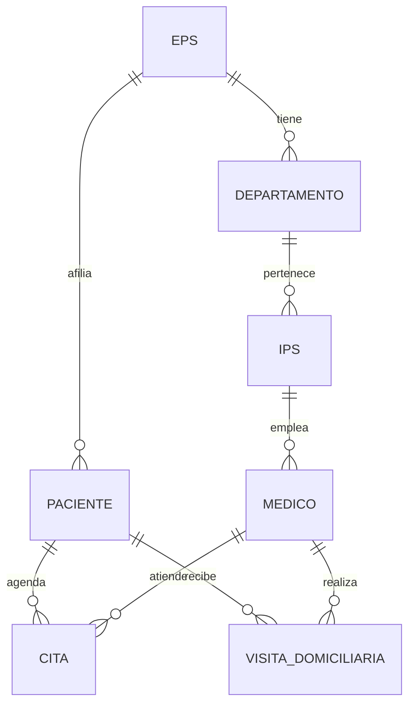

Este proyecto de referencia presenta el modelado e implementación de una base de datos relacional para una **EPS colombiana (Entidad Promotora de Salud)**. El esquema abarca la afiliación de pacientes, la red de clínicas IPS, el cuerpo médico, la programación de citas, el catálogo de medicamentos, los servicios disponibles y las visitas domiciliarias. Fue construido como ejemplo guía del curso **Bases de Datos Relacionales 2026-I** y está acompañado por un contraejemplo en MongoDB para comparar los enfoques relacional y documental sobre el mismo dominio.

## Universo de Discurso

Una EPS actúa como aseguradora de salud: afilia pacientes, define su red de **IPS** (Instituciones Prestadoras de Servicios de Salud) distribuidas en **departamentos**, contrata **médicos** especializados y gestiona los **servicios médicos** disponibles. Los pacientes agendan **citas** con médicos de la red, quienes también pueden realizar **visitas domiciliarias** para pacientes con movilidad reducida o situaciones de urgencia. El sistema lleva un catálogo de **medicamentos** con su principio activo y dosis estándar para apoyar la formulación médica.

## Esquema Relacional

```sql
-- Tabla: eps
CREATE TABLE eps (
  id_eps    INT          PRIMARY KEY,
  nombre    VARCHAR(100) NOT NULL,
  nit       VARCHAR(20)  UNIQUE,
  direccion VARCHAR(200),
  telefono  VARCHAR(20)
);

-- Tabla: departamento
CREATE TABLE departamento (
  id_depto INT          PRIMARY KEY,
  nombre   VARCHAR(100) NOT NULL,
  id_eps   INT,
  FOREIGN KEY (id_eps) REFERENCES eps(id_eps)
);

-- Tabla: ips
CREATE TABLE ips (
  id_ips    INT          PRIMARY KEY,
  nombre    VARCHAR(100) NOT NULL,
  direccion VARCHAR(200),
  ciudad    VARCHAR(100),
  id_depto  INT,
  FOREIGN KEY (id_depto) REFERENCES departamento(id_depto)
);

-- Tabla: medico
CREATE TABLE medico (
  id_medico        INT         PRIMARY KEY,
  nombre           VARCHAR(100) NOT NULL,
  apellido         VARCHAR(100),
  especialidad     VARCHAR(100),
  registro_medico  VARCHAR(50)  UNIQUE,
  id_ips           INT,
  FOREIGN KEY (id_ips) REFERENCES ips(id_ips)
);

-- Tabla: paciente
CREATE TABLE paciente (
  id_paciente      INT         PRIMARY KEY,
  nombre           VARCHAR(100) NOT NULL,
  apellido         VARCHAR(100),
  documento        VARCHAR(20)  UNIQUE,
  fecha_nacimiento DATE,
  telefono         VARCHAR(20),
  id_eps           INT,
  FOREIGN KEY (id_eps) REFERENCES eps(id_eps)
);

-- Tabla: cita
CREATE TABLE cita (
  id_cita     INT          PRIMARY KEY,
  id_paciente INT,
  id_medico   INT,
  fecha_cita  TIMESTAMP,
  motivo      VARCHAR(200),
  estado      VARCHAR(50),
  FOREIGN KEY (id_paciente) REFERENCES paciente(id_paciente),
  FOREIGN KEY (id_medico)   REFERENCES medico(id_medico)
);

-- Tabla: medicamento
CREATE TABLE medicamento (
  id_medicamento  INT          PRIMARY KEY,
  nombre          VARCHAR(100) NOT NULL,
  principio_activo VARCHAR(100),
  dosis_estandar  VARCHAR(50)
);

-- Tabla: servicio
CREATE TABLE servicio (
  id_servicio INT            PRIMARY KEY,
  nombre      VARCHAR(100)   NOT NULL,
  tipo        VARCHAR(50),
  costo       DECIMAL(10,2)
);

-- Tabla: visita_domiciliaria
CREATE TABLE visita_domiciliaria (
  id_visita     INT       PRIMARY KEY,
  id_paciente   INT,
  id_medico     INT,
  fecha_visita  TIMESTAMP,
  direccion     VARCHAR(200),
  observaciones TEXT,
  FOREIGN KEY (id_paciente) REFERENCES paciente(id_paciente),
  FOREIGN KEY (id_medico)   REFERENCES medico(id_medico)
);
```

## Diagrama Entidad-Relación



## Consultas SQL de Referencia

<Tabs>
  <Tab title="Reportes de citas">
```sql
-- Citas por médico y especialidad
SELECT
  m.nombre || ' ' || m.apellido AS medico,
  m.especialidad,
  COUNT(c.id_cita)               AS total_citas
FROM medico m
LEFT JOIN cita c ON m.id_medico = c.id_medico
GROUP BY m.id_medico, m.nombre, m.apellido, m.especialidad
ORDER BY total_citas DESC;

-- Citas pendientes en los próximos 7 días
SELECT
  p.nombre || ' ' || p.apellido AS paciente,
  m.nombre || ' ' || m.apellido AS medico,
  m.especialidad,
  c.fecha_cita,
  c.motivo
FROM cita c
JOIN paciente p ON c.id_paciente = p.id_paciente
JOIN medico   m ON c.id_medico   = m.id_medico
WHERE c.estado     = 'programada'
  AND c.fecha_cita BETWEEN NOW() AND NOW() + INTERVAL '7 days'
ORDER BY c.fecha_cita;
```
  </Tab>
  <Tab title="Visitas domiciliarias">
```sql
-- Pacientes con más visitas domiciliarias
SELECT
  p.nombre || ' ' || p.apellido AS paciente,
  COUNT(v.id_visita)             AS total_visitas
FROM paciente p
JOIN visita_domiciliaria v ON p.id_paciente = v.id_paciente
GROUP BY p.id_paciente, p.nombre, p.apellido
HAVING COUNT(v.id_visita) > 1
ORDER BY total_visitas DESC;
```
  </Tab>
  <Tab title="Cobertura por IPS">
```sql
-- IPS con mayor número de médicos por departamento
SELECT
  d.nombre   AS departamento,
  i.nombre   AS ips,
  COUNT(m.id_medico) AS num_medicos
FROM departamento d
JOIN ips    i ON d.id_depto = i.id_depto
JOIN medico m ON i.id_ips   = m.id_ips
GROUP BY d.id_depto, d.nombre, i.id_ips, i.nombre
ORDER BY num_medicos DESC;

-- Especialidades disponibles por ciudad
SELECT
  i.ciudad,
  m.especialidad,
  COUNT(m.id_medico) AS medicos_disponibles
FROM ips    i
JOIN medico m ON i.id_ips = m.id_ips
GROUP BY i.ciudad, m.especialidad
ORDER BY i.ciudad, medicos_disponibles DESC;
```
  </Tab>
</Tabs>

## Diccionario de Datos

<AccordionGroup>
  <Accordion title="eps — Entidad Promotora de Salud">
    | Columna | Tipo | Restricciones | Descripción |
    |---|---|---|---|
    | `id_eps` | INT | PK | Identificador interno de la EPS. |
    | `nombre` | VARCHAR(100) | NOT NULL | Razón social de la EPS. |
    | `nit` | VARCHAR(20) | UNIQUE | Número de Identificación Tributaria de la entidad. |
    | `direccion` | VARCHAR(200) | — | Dirección de la sede principal. |
    | `telefono` | VARCHAR(20) | — | Número de contacto general. |
  </Accordion>

  <Accordion title="departamento — Unidad administrativa interna">
    | Columna | Tipo | Restricciones | Descripción |
    |---|---|---|---|
    | `id_depto` | INT | PK | Identificador del departamento. |
    | `nombre` | VARCHAR(100) | NOT NULL | Nombre del departamento (puede ser geográfico o administrativo). |
    | `id_eps` | INT | FK → eps | EPS a la que pertenece este departamento. |
  </Accordion>

  <Accordion title="ips — Institución Prestadora de Servicios">
    | Columna | Tipo | Restricciones | Descripción |
    |---|---|---|---|
    | `id_ips` | INT | PK | Identificador de la IPS. |
    | `nombre` | VARCHAR(100) | NOT NULL | Nombre de la clínica u hospital. |
    | `direccion` | VARCHAR(200) | — | Dirección física de la IPS. |
    | `ciudad` | VARCHAR(100) | — | Ciudad donde opera la IPS. |
    | `id_depto` | INT | FK → departamento | Departamento administrativo al que pertenece. |
  </Accordion>

  <Accordion title="medico — Personal médico">
    | Columna | Tipo | Restricciones | Descripción |
    |---|---|---|---|
    | `id_medico` | INT | PK | Identificador del médico. |
    | `nombre` | VARCHAR(100) | NOT NULL | Nombre del médico. |
    | `apellido` | VARCHAR(100) | — | Apellido del médico. |
    | `especialidad` | VARCHAR(100) | — | Especialidad médica (ej. Cardiología, Pediatría). |
    | `registro_medico` | VARCHAR(50) | UNIQUE | Número de registro profesional ante el ente regulador. |
    | `id_ips` | INT | FK → ips | IPS donde ejerce el médico. |
  </Accordion>

  <Accordion title="paciente — Afiliado a la EPS">
    | Columna | Tipo | Restricciones | Descripción |
    |---|---|---|---|
    | `id_paciente` | INT | PK | Identificador del paciente. |
    | `nombre` | VARCHAR(100) | NOT NULL | Nombre del paciente. |
    | `apellido` | VARCHAR(100) | — | Apellido del paciente. |
    | `documento` | VARCHAR(20) | UNIQUE | Número de cédula, pasaporte o tarjeta de identidad. |
    | `fecha_nacimiento` | DATE | — | Fecha de nacimiento para cálculo de edad. |
    | `telefono` | VARCHAR(20) | — | Número de contacto del paciente o acudiente. |
    | `id_eps` | INT | FK → eps | EPS a la que está afiliado el paciente. |
  </Accordion>

  <Accordion title="cita — Cita médica programada">
    | Columna | Tipo | Restricciones | Descripción |
    |---|---|---|---|
    | `id_cita` | INT | PK | Identificador de la cita. |
    | `id_paciente` | INT | FK → paciente | Paciente que solicita la cita. |
    | `id_medico` | INT | FK → medico | Médico que atiende la cita. |
    | `fecha_cita` | TIMESTAMP | — | Fecha y hora programada para la cita. |
    | `motivo` | VARCHAR(200) | — | Motivo de consulta registrado al agendar. |
    | `estado` | VARCHAR(50) | — | Estado de la cita: `programada`, `atendida`, `cancelada`, `no asistió`. |
  </Accordion>

  <Accordion title="medicamento — Catálogo farmacológico">
    | Columna | Tipo | Restricciones | Descripción |
    |---|---|---|---|
    | `id_medicamento` | INT | PK | Identificador del medicamento. |
    | `nombre` | VARCHAR(100) | NOT NULL | Nombre comercial del medicamento. |
    | `principio_activo` | VARCHAR(100) | — | Sustancia activa principal (nombre genérico). |
    | `dosis_estandar` | VARCHAR(50) | — | Dosis de referencia, ej. `500 mg cada 8 horas`. |
  </Accordion>

  <Accordion title="servicio — Servicios médicos disponibles">
    | Columna | Tipo | Restricciones | Descripción |
    |---|---|---|---|
    | `id_servicio` | INT | PK | Identificador del servicio. |
    | `nombre` | VARCHAR(100) | NOT NULL | Nombre del servicio (ej. Laboratorio clínico, Rayos X). |
    | `tipo` | VARCHAR(50) | — | Categoría del servicio: `diagnóstico`, `tratamiento`, `prevención`. |
    | `costo` | DECIMAL(10,2) | — | Tarifa base del servicio antes de descuentos de cobertura. |
  </Accordion>

  <Accordion title="visita_domiciliaria — Atención en domicilio">
    | Columna | Tipo | Restricciones | Descripción |
    |---|---|---|---|
    | `id_visita` | INT | PK | Identificador de la visita. |
    | `id_paciente` | INT | FK → paciente | Paciente que recibe la visita. |
    | `id_medico` | INT | FK → medico | Médico que realiza la visita. |
    | `fecha_visita` | TIMESTAMP | — | Fecha y hora de la visita domiciliaria. |
    | `direccion` | VARCHAR(200) | — | Dirección en la que se realiza la visita. |
    | `observaciones` | TEXT | — | Notas clínicas del médico sobre la visita. |
  </Accordion>
</AccordionGroup>

## Comparación: SQL vs NoSQL

El repositorio del curso también incluye una versión **MongoDB** de este mismo dominio. La siguiente comparación ilustra las diferencias de modelado para una entidad central como el paciente y su historial de citas.

<Note>
  La contraparte NoSQL del proyecto EPS utiliza colecciones MongoDB (`pacientes`, `citas`, `medicos`, `ips`). El esquema documental desnormaliza datos para optimizar lecturas, mientras que el esquema relacional prioriza la integridad referencial y la consistencia transaccional. Ambos enfoques son válidos según el contexto de uso; este curso se centra en el modelo relacional.
</Note>

<CardGroup cols={2}>
  <Card title="Modelo Relacional (SQL)" icon="table">
    ```sql
    -- Tres tablas separadas con integridad referencial
    SELECT
      p.nombre, p.apellido,
      c.fecha_cita, c.motivo,
      m.especialidad
    FROM paciente p
    JOIN cita   c ON p.id_paciente = c.id_paciente
    JOIN medico m ON c.id_medico   = m.id_medico
    WHERE p.documento = '12345678';
    ```
    **Ventajas:** integridad referencial garantizada, sin duplicación de datos, consultas complejas con JOINs, transacciones ACID.
  </Card>
  <Card title="Modelo Documental (MongoDB)" icon="database">
    ```js
    // Un documento con citas embebidas
    db.pacientes.findOne(
      { documento: "12345678" },
      { nombre: 1, apellido: 1, citas: 1 }
    )
    // Documento resultante:
    // { nombre: "Ana", apellido: "Gómez",
    //   citas: [{ fecha: ..., medico: "Dr. López",
    //             especialidad: "Cardiología" }] }
    ```
    **Ventajas:** lectura del perfil completo en una sola operación, esquema flexible, escalabilidad horizontal nativa.
  </Card>
</CardGroup>

## Extensiones Sugeridas

<CardGroup cols={2}>
  <Card title="Formulación de Medicamentos" icon="pills">
    Agregar tabla `formulacion(id_formulacion, id_cita, id_medicamento, cantidad, indicaciones)` para registrar los medicamentos prescritos en cada cita.
  </Card>
  <Card title="Autorizaciones de Servicios" icon="file-medical">
    Tabla `autorizacion(id_auth, id_paciente, id_servicio, fecha_solicitud, estado, id_medico_solicitante)` para el flujo de aprobación de procedimientos costosos.
  </Card>
  <Card title="Búsqueda Semántica con pgvector" icon="magnifying-glass">
    Agregar `embedding vector(384)` en `medicamento` y `servicio` para recomendación semántica basada en síntomas descritos por el paciente en lenguaje natural.
  </Card>
  <Card title="Auditoría de Cambios" icon="clock-rotate-left">
    Tabla `auditoria(id, tabla, operacion, usuario, fecha, datos_anteriores JSONB)` para registrar INSERT, UPDATE y DELETE con triggers de PostgreSQL.
  </Card>
</CardGroup>
