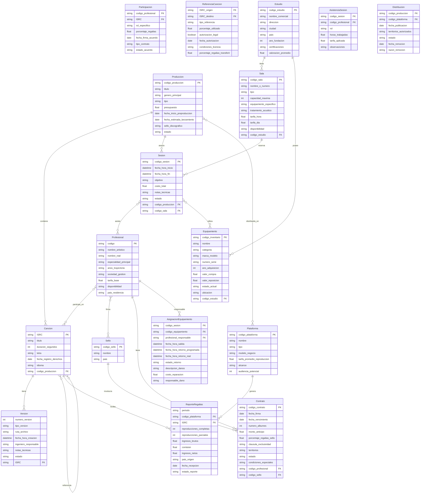

En este segundo taller aplicarás los conceptos del modelamiento EER a un dominio de mayor complejidad: un **sistema de gestión musical**. El sistema debe permitir que una discográfica administre artistas, álbumes y canciones, mientras que los usuarios de la plataforma crean y comparten playlists. A lo largo del taller identificarás entidades, atributos, relaciones con sus cardinalidades y aplicarás extensiones EER como jerarquías de especialización. Al finalizar, contarás con un diagrama EER completo en draw.io y un mapeo preliminar al modelo lógico relacional.

---

## Universo de Discurso

Lee atentamente el siguiente universo de discurso antes de comenzar a modelar. Subraya los sustantivos (posibles entidades o atributos) y los verbos (posibles relaciones).

> Una discográfica administra **artistas**. Cada artista tiene un identificador único, un nombre artístico y un género musical principal. Un artista puede ser un solista o una banda; en el caso de las bandas, se registra el número de integrantes.
>
> Los artistas graban **álbumes**. Cada álbum tiene un código único, un título, el año de lanzamiento y el nombre de la discográfica que lo publicó. Un álbum puede haber sido grabado por uno o varios artistas (colaboraciones), y un artista puede tener varios álbumes en su catálogo.
>
> Los álbumes contienen **canciones**. Cada canción tiene un código único, un título, la duración en segundos y el número de pista dentro del álbum. Una canción pertenece a exactamente un álbum.
>
> Los **usuarios** de la plataforma pueden crear **playlists**. Cada usuario tiene un identificador, un nombre de usuario único y un correo electrónico. Cada playlist tiene un identificador, un nombre y la fecha de creación. Un usuario puede tener múltiples playlists, y cada playlist le pertenece a exactamente un usuario.
>
> Una playlist puede incluir múltiples canciones, y una misma canción puede aparecer en múltiples playlists. Cuando una canción se agrega a una playlist se registra el orden en que aparece dentro de ella.
>
> Los artistas **firman contratos** con **discográficas**. Un contrato tiene una fecha de inicio, una fecha de fin y un porcentaje de regalías pactado. Un artista puede tener contratos con distintas discográficas a lo largo del tiempo, y una discográfica puede contratar a múltiples artistas.

<Note>
Aunque el álbum ya contiene el nombre de la discográfica como atributo, la entidad `Discográfica` existe de forma independiente porque aparece también en los contratos. Nunca dupliques datos que pertenecen a una entidad propia — usa una relación.
</Note>

---

## Proceso de Modelamiento

<Steps>
  <Step title="Identificar las entidades principales">
    Tras leer el UoD, las entidades candidatas son:

    | Entidad | Descripción |
    |---------|-------------|
    | `Artista` | Persona o grupo que graba música |
    | `Álbum` | Colección de canciones publicada por un artista |
    | `Canción` | Pista de audio individual dentro de un álbum |
    | `Playlist` | Lista de reproducción creada por un usuario |
    | `Usuario` | Persona registrada en la plataforma |
    | `Discográfica` | Empresa que publica álbumes y firma contratos |

    **Atributos clave por entidad:**

    ```
    Artista       : id_artista (PK), nombre_artistico, genero
    Álbum         : cod_album (PK), titulo, anio_lanzamiento
    Canción       : cod_cancion (PK), titulo, duracion_seg, num_pista
    Playlist      : id_playlist (PK), nombre, fecha_creacion
    Usuario       : id_usuario (PK), username (único), email
    Discográfica  : id_discografica (PK), nombre, pais
    Contrato      : (ver paso 2 — es una relación con atributos)
    ```
  </Step>

  <Step title="Identificar relaciones y cardinalidades">
    Define las relaciones entre entidades con sus cardinalidades mínima y máxima:

    | Relación | Entidades | Cardinalidad | Atributos de relación |
    |----------|-----------|--------------|----------------------|
    | `graba` | Artista ↔ Álbum | M : N | — |
    | `contiene` | Álbum ↔ Canción | 1 : N | — |
    | `incluye` | Playlist ↔ Canción | M : N | `orden_en_playlist` |
    | `crea` | Usuario ↔ Playlist | 1 : N | — |
    | `firma` | Artista ↔ Discográfica | M : N | `fecha_inicio`, `fecha_fin`, `royalty_pct` |

    <Warning>
      Las relaciones **M:N** (`graba`, `incluye`, `firma`) **no pueden representarse directamente como claves foráneas** en el modelo relacional. Cada una requerirá una **tabla intermedia (junction table)** con las claves de ambas entidades participantes y, si aplica, los atributos propios de la relación. Por ejemplo, `firma` se convierte en la tabla `Contrato(id_artista FK, id_discografica FK, fecha_inicio, fecha_fin, royalty_pct)`.
    </Warning>
  </Step>

  <Step title="Definir claves primarias y foráneas">
    Con las entidades y relaciones claras, establece las claves del modelo lógico preliminar:

    ```sql
    -- Claves primarias
    Artista        PK: id_artista
    Album          PK: cod_album
    Cancion        PK: cod_cancion
    Playlist       PK: id_playlist
    Usuario        PK: id_usuario
    Discografica   PK: id_discografica

    -- Claves foráneas directas (relaciones 1:N)
    Cancion.cod_album        → Album.cod_album
    Playlist.id_usuario      → Usuario.id_usuario

    -- Tablas intermedias (relaciones M:N)
    Artista_Album  (id_artista FK, cod_album FK)         -- graba
    Playlist_Cancion (id_playlist FK, cod_cancion FK,
                      orden_en_playlist)                  -- incluye
    Contrato (id_artista FK, id_discografica FK,
              fecha_inicio, fecha_fin, royalty_pct)       -- firma
    ```
  </Step>

  <Step title="Mapear a draw.io y construir el diagrama EER">
    Con la estructura definida, construye el diagrama en [app.diagrams.net](https://app.diagrams.net):

    1. **Abre draw.io** y crea un nuevo archivo llamado `taller2_gestion_musical.drawio`.
    2. **Activa la librería Entity Relation** desde el panel lateral.
    3. **Dibuja cada entidad** como un rectángulo con su nombre en la cabecera y sus atributos listados abajo (o como elipses conectadas en notación Chen).
    4. **Marca las PKs** subrayando el atributo o con el prefijo `PK:`.
    5. **Dibuja las relaciones**: usa rombos para las relaciones con nombre y conecta las entidades con las cardinalidades correctas en los extremos (notación crow's foot o (min,max)).
    6. **Añade atributos de relación** a los rombos correspondientes (`Contrato`, `incluye`).
    7. **Aplica la jerarquía** del siguiente paso.

    <Tip>
      En draw.io puedes usar *Extras → Edit Diagram* para pegar XML directamente. Si exportas el archivo `.drawio` desde otra fuente, puedes abrirlo en draw.io sin perder el formato. Usa *View → Fit Page* (`Ctrl+Shift+H`) para ver todo el diagrama de un vistazo.
    </Tip>
  </Step>

  <Step title="Aplicar extensiones EER: jerarquía de Artista">
    El UoD indica que un artista puede ser **Solista** o **Banda**. Esto es una especialización:

    - **Superclase**: `Artista` (atributos comunes: `id_artista`, `nombre_artistico`, `genero`).
    - **Subclase `Solista`**: sin atributos adicionales en este UoD (puedes agregar `instrumento_principal` si lo deseas).
    - **Subclase `Banda`**: atributo adicional `num_integrantes`.

    **Restricciones de la especialización:**

    | Dimensión | Decisión | Justificación |
    |-----------|----------|---------------|
    | Participación | **Total** | Todo artista en el sistema es solista o banda |
    | Solapamiento | **Disjoint (d)** | Un artista no puede ser simultáneamente solista y banda |

    En draw.io representa esto con el shape **Specialization** (triángulo / círculo con `d`) conectado a `Artista` arriba y `Solista` / `Banda` abajo, con doble línea entre `Artista` y el símbolo de especialización para indicar participación total.
  </Step>
</Steps>

---

## Modelo Conceptual (Diagrama Mermaid)

El siguiente diagrama representa las relaciones principales del sistema en notación ER de Mermaid. Úsalo como referencia para verificar tu diagrama en draw.io.



---

## Mapeo al Modelo Lógico (Tablas Relacionales)

Una vez validado el diagrama EER, se aplican las reglas de mapeo para obtener el esquema relacional.

```sql
-- Entidades principales
CREATE TABLE Artista (
    id_artista      VARCHAR(10)  PRIMARY KEY,
    nombre_artistico VARCHAR(100) NOT NULL,
    genero          VARCHAR(50)
);

CREATE TABLE Solista (
    id_artista      VARCHAR(10)  PRIMARY KEY,
    instrumento     VARCHAR(50),
    FOREIGN KEY (id_artista) REFERENCES Artista(id_artista)
);

CREATE TABLE Banda (
    id_artista      VARCHAR(10)  PRIMARY KEY,
    num_integrantes INT          CHECK (num_integrantes > 0),
    FOREIGN KEY (id_artista) REFERENCES Artista(id_artista)
);

CREATE TABLE Discografica (
    id_discografica VARCHAR(10)  PRIMARY KEY,
    nombre          VARCHAR(100) NOT NULL,
    pais            VARCHAR(50)
);

CREATE TABLE Album (
    cod_album       VARCHAR(10)  PRIMARY KEY,
    titulo          VARCHAR(150) NOT NULL,
    anio_lanzamiento INT         CHECK (anio_lanzamiento > 1900)
);

CREATE TABLE Cancion (
    cod_cancion     VARCHAR(10)  PRIMARY KEY,
    titulo          VARCHAR(150) NOT NULL,
    duracion_seg    INT          CHECK (duracion_seg > 0),
    num_pista       INT,
    cod_album       VARCHAR(10)  NOT NULL,
    FOREIGN KEY (cod_album) REFERENCES Album(cod_album)
);

CREATE TABLE Usuario (
    id_usuario      VARCHAR(10)  PRIMARY KEY,
    username        VARCHAR(50)  UNIQUE NOT NULL,
    email           VARCHAR(100) UNIQUE NOT NULL
);

CREATE TABLE Playlist (
    id_playlist     VARCHAR(10)  PRIMARY KEY,
    nombre          VARCHAR(100) NOT NULL,
    fecha_creacion  DATE,
    id_usuario      VARCHAR(10)  NOT NULL,
    FOREIGN KEY (id_usuario) REFERENCES Usuario(id_usuario)
);

-- Tablas intermedias (relaciones M:N)
CREATE TABLE Artista_Album (
    id_artista  VARCHAR(10),
    cod_album   VARCHAR(10),
    PRIMARY KEY (id_artista, cod_album),
    FOREIGN KEY (id_artista) REFERENCES Artista(id_artista),
    FOREIGN KEY (cod_album)  REFERENCES Album(cod_album)
);

CREATE TABLE Playlist_Cancion (
    id_playlist   VARCHAR(10),
    cod_cancion   VARCHAR(10),
    orden         INT NOT NULL CHECK (orden > 0),
    PRIMARY KEY (id_playlist, cod_cancion),
    FOREIGN KEY (id_playlist) REFERENCES Playlist(id_playlist),
    FOREIGN KEY (cod_cancion) REFERENCES Cancion(cod_cancion)
);

CREATE TABLE Contrato (
    id_artista      VARCHAR(10),
    id_discografica VARCHAR(10),
    fecha_inicio    DATE NOT NULL,
    fecha_fin       DATE,
    royalty_pct     NUMERIC(5,2) CHECK (royalty_pct BETWEEN 0 AND 100),
    PRIMARY KEY (id_artista, id_discografica, fecha_inicio),
    FOREIGN KEY (id_artista)      REFERENCES Artista(id_artista),
    FOREIGN KEY (id_discografica) REFERENCES Discografica(id_discografica)
);
```

<Warning>
  Observa que la PK de `Contrato` incluye `fecha_inicio` además de las dos FKs. Esto permite que un mismo artista tenga **múltiples contratos** con la misma discográfica en diferentes períodos. Sin `fecha_inicio` en la PK, solo podría existir un contrato por par artista-discográfica.
</Warning>

---

## Preguntas de Discusión

<AccordionGroup>
  <Accordion title="¿Por qué Contrato no es una entidad débil en el EER?">
    Una entidad débil depende de su entidad propietaria para su identificación **y** para su existencia. `Contrato` depende de `Artista` y `Discográfica` para ser identificado, pero en muchos diseños se le asigna un `id_contrato` propio, lo que lo convertiría en entidad fuerte. En el modelo presentado lo tratamos como relación con atributos porque su identidad está completamente determinada por (artista, discográfica, fecha_inicio). La decisión depende de qué tan central es el contrato para el negocio.
  </Accordion>

  <Accordion title="¿Debería Álbum tener una FK directa a Discográfica?">
    El UoD menciona que el álbum registra el nombre de la discográfica que lo publicó. Si modelamos `Discográfica` como entidad separada (lo cual es correcto dado que también participa en contratos), entonces `Album` debería tener una FK `id_discografica` en lugar de guardar el nombre como texto. Esto evita inconsistencias: si la discográfica cambia de nombre, solo se actualiza en un lugar.
  </Accordion>

  <Accordion title="¿Es correcto que Canción pertenezca a exactamente un Álbum?">
    El UoD lo indica explícitamente: "una canción pertenece a exactamente un álbum". Sin embargo, en la realidad musical existen canciones que aparecen en múltiples álbumes (reediciones, compilaciones). Si el sistema debe soportar ese caso, la relación `contiene` cambia de 1:N a M:N, lo que requiere una tabla intermedia `Album_Cancion`. Este es un buen ejemplo de cómo el UoD puede simplificar la realidad y cómo el diseñador debe cuestionar esas simplificaciones con el cliente.
  </Accordion>

  <Accordion title="¿Qué ocurre con la especialización Solista/Banda en el modelo lógico?">
    Existen tres estrategias de mapeo para jerarquías EER: (1) **una tabla por jerarquía** (todo en `Artista` con columnas nulas según el tipo), (2) **una tabla por subclase** (solo los atributos específicos en `Solista` y `Banda`, con FK a `Artista`), y (3) **una tabla por clase** (cada subclase incluye todos los atributos heredados). El SQL presentado usa la estrategia (2), que es la más flexible y la que mejor preserva la semántica del EER.
  </Accordion>

  <Accordion title="¿Cómo modelarías las 'colaboraciones' entre artistas en una canción?">
    El modelo actual relaciona artistas con álbumes completos (`Artista_Album`). Si se necesita registrar qué artistas participan en **cada canción** (feat.), habría que agregar una relación M:N entre `Artista` y `Canción`, con una tabla `Artista_Cancion(id_artista, cod_cancion, rol)` donde `rol` podría ser 'Principal' o 'Invitado'. Este es un requisito que no está en el UoD actual pero es plausible en un sistema real.
  </Accordion>
</AccordionGroup>

---

## Entregable del Taller

1. **Archivo `taller2_gestion_musical.drawio`** con el diagrama EER completo, incluyendo la jerarquía `Artista → Solista / Banda` y todos los atributos de relación.
2. **Script SQL** (`.sql`) con el DDL completo del modelo lógico mapeado desde el EER, incluyendo restricciones `CHECK`, `NOT NULL` y `UNIQUE` donde apliquen.
3. **Documento de decisiones** (máximo 1 página) respondiendo al menos dos de las preguntas de discusión de arriba con justificación técnica.
4. Sube los tres archivos al espacio del Taller 2 en la plataforma antes de la fecha límite.
